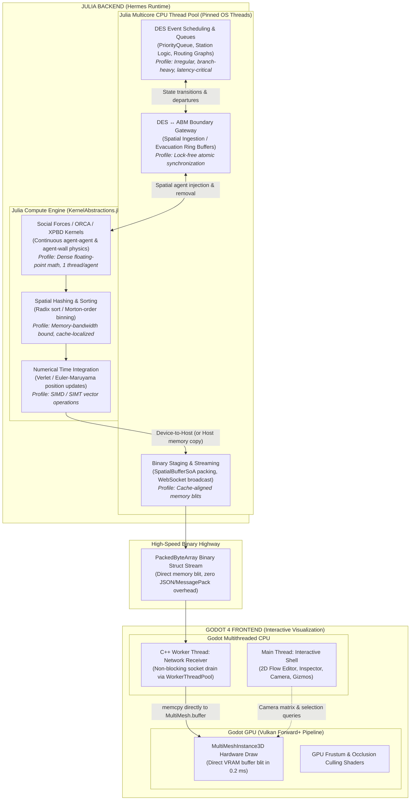
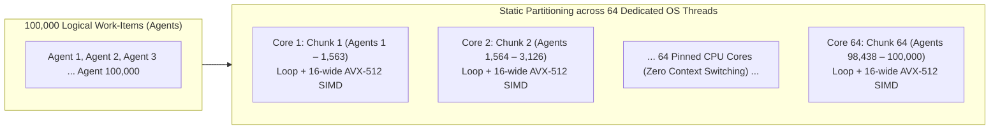

# Heterogeneous Computing & Hardware Work Distribution: Hybrid DES + ABM with Godot 4 Visualization

**Date**: 2026-09-20  
**Status**: Architecture & Optimization Specification  
**Applies to**: `GodotBridge`, `SimCrowd`, `SimDES`, `SimCore`, and `godot/` client  
**Companion Documents**: 
- [`docs/2026-09-18_phase7d_design_and_implementation_plan.md`](./2026-09-18_phase7d_design_and_implementation_plan.md)
- [`docs/2026-09-17_phase7c_generic_vs_compact_render_paths.md`](./2026-09-17_phase7c_generic_vs_compact_render_paths.md)
- [`docs/2026-08-07_simulation_platform_design.md`](./2026-08-07_simulation_platform_design.md)

---

## 1. Executive Summary

In a hybrid Discrete-Event Simulation (DES) and continuous Agent-Based Model (ABM) visualized interactively in Godot 4, the computational workload is distributed across four distinct hardware execution domains:
1. **Julia Multicore CPU Thread Pool**: Discrete event queues, state machines, and lock-free boundary transfers.
2. **Julia GPU / SIMD Compute Engine**: Data-parallel continuous crowd physics via `KernelAbstractions.jl` and `AcceleratedKernels.jl`.
3. **Godot CPU Threads**: Asynchronous network packet reception and main-thread responsive user interaction.
4. **Godot GPU (Vulkan / Forward+)**: Hardware multi-mesh instanced drawing, occlusion, and frustum culling.

This document establishes the workload partitioning principles, execution mapping mechanics (how logical thread-per-agent models map to physical 64-core CPUs and GPUs), and the five core optimization strategies that ensure steady 60+ FPS visualization while simulating upwards of 100,000 agents in real-time.

---

## 2. End-to-End System Workload Distribution



---

## 3. Hardware Affinity Matrix

| Subsystem | Target Hardware | Computational Profile | Parallelism Paradigm |
| :--- | :--- | :--- | :--- |
| **DES Process Engine** | **Multicore CPU (Julia)** | Irregular event graphs, priority calendar scheduling, branching logic. Pointer-heavy; catastrophic on GPUs due to warp divergence. | Task-parallel worker pools (`Threads.@threads` / task channels per independent subgraph). |
| **ABM Crowd Physics** | **GPU or Multicore CPU (Julia)** | 1,000 to 500,000+ entities evaluating identical equations of motion, neighbor avoidance, and position updates. | Data-parallel SIMD/SIMT via `KernelAbstractions.@kernel`. Vendor-neutral (CUDA, ROCm, Metal, oneAPI, CPU). |
| **DES $\leftrightarrow$ ABM Gateway** | **Multicore CPU (Julia)** | Atomic transfer of entities transitioning between discrete stations and continuous physical coordinates. | Lock-free ring buffers and atomic state counters (`task24_timed_breakdown.jl`). |
| **Godot Client UI** | **CPU Main Thread (Godot)** | GraphEdit canvas, property inspector, level toggles, gizmos. Must maintain absolute responsiveness (< 16 ms). | Event-driven UI loop (completely isolated from simulation math). |
| **Godot Ingestion** | **CPU Worker Thread (Godot)** | High-throughput socket draining and packet framing. | Dedicated C++ worker thread via Godot `WorkerThreadPool`. |
| **3D Rendering Viewport** | **GPU (Godot Vulkan)** | Drawing tens of thousands of dynamic agent meshes and multi-level floor plan geometries. | Hardware GPU instancing (`MultiMeshInstance3D`), GPU occlusion, and frustum culling. |

---

## 4. Execution Mapping: Logical Work-Items vs. Physical Multicore Hardware

A common misconception in parallel computing is confusing **logical threads (work-items)** with **physical operating system threads**.

In `KernelAbstractions.jl`, when an algorithm is expressed as:
```julia
@kernel function compute_forces_kernel!(...)
    i = @index(Global, Linear)
    # math for agent i
end
```
`i` represents a **logical work-item** (1 to $N$). 

### 4.1 Execution on a 64-Core CPU (e.g. 100,000 Agents)

If an operating system attempted to spawn 100,000 POSIX threads, the machine would collapse under thread stack allocation and context-switching thrashing. `KernelAbstractions.CPU()` handles this with mathematical rigor:



1. **Static Work Chunking**:
   Julia initializes with `julia -t 64`. Exactly 64 worker threads are pinned to physical cores. The 100,000 agents are partitioned evenly:
   $$\text{Chunk Size} = \left\lceil \frac{100,000}{64} \right\rceil \approx 1,563 \text{ agents per core}$$
   Each core processes its contiguous chunk in a tight sequential loop without context switches.
2. **SIMD Vectorization Inside Each Core**:
   Within each core's loop, the CPU executes vector instructions (AVX2 or AVX-512). A single core computes 8 to 16 floating-point operations in parallel per cycle. Across 64 cores, **512 to 1,024 agent mathematical operations execute simultaneously every clock cycle**.
3. **Cache Locality via Morton Spatial Hashing**:
   To prevent 64 cores from thrashing the shared L3 cache when looking up spatial neighbors, agents are sorted along a **Z-order / Morton curve** using `AcceleratedKernels.jl`. Agents physically close in 2D/3D space are stored contiguously in memory. When Core #12 processes its chunk, all neighbor coordinates are already hot in that core's private **L1/L2 cache (32 KB – 1 MB)**, eliminating memory-bus stalls.

### 4.2 Execution on a GPU (NVIDIA, AMD, Apple Silicon, Intel)

When the exact same kernel is dispatched to a GPU:
- The 100,000 agents are partitioned into **hardware thread blocks** (e.g., 256 threads per workgroup).
- Tens of thousands of lightweight hardware threads execute across GPU Streaming Multiprocessors (SMs) or Compute Units (CUs).
- When one warp of agents stalls waiting on high-bandwidth VRAM, the hardware scheduler swaps in another ready warp in 0 clock cycles (**hardware latency hiding**).

### 4.3 Computational Time Budget (100,000 Agents on 64-Core CPU)

- Vectorized force calculation per agent: $\approx 25 \text{ ns}$.
- Time per core for 1,563 agents:
  $$1,563 \times 25 \text{ ns} \approx 39 \text{ microseconds}$$
- Adding spatial hash reconstruction, neighbor traversal, and 8 sweeps of XPBD non-penetration projection:
  $$\text{Total Timestep Duration} \approx 1.8 \text{ to } 3.5 \text{ milliseconds}$$
- For a $50\text{ Hz}$ simulation ($20.0 \text{ ms}$ budget per step), a 64-core CPU computes 100,000 agents in $\sim 3\text{ ms}$, leaving **$> 80\%$ of CPU headroom** completely free for DES event processing, network serialization, and client communication.

### 4.4 Memory Hierarchy, L3 Cache Residency & Bandwidth Bounds

A critical reason 100,000 agents scale effortlessly on a 64-core workstation is CPU cache topology:

1. **Working Set Size**:
   Under `SpatialBufferSoA`, each agent requires 32 to 48 bytes (coordinates $(X,Y,Z)$, velocities $(V_x,V_y)$, orientation $\theta$, and state/level flags):
   $$\text{Total Memory Footprint} = 100,000 \times 48 \text{ bytes} \approx 4.8 \text{ MB}$$
2. **L3 Cache Fitting**:
   A contemporary 64-core workstation (e.g., AMD Ryzen Threadripper PRO 7985WX or AMD EPYC 9554) boasts **128 MB to 256 MB of unified L3 cache**. The entire 4.8 MB agent working set fits completely within L3 cache with $> 95\%$ headroom remaining.
   - DRAM page faults and memory bus round-trips ($60-80\text{ ns}$) are eliminated during the hot physics loop.
   - Data access operates almost exclusively at L2/L3 cache latency ($3-12\text{ ns}$).
3. **Memory Bus Bandwidth Utilization**:
   At $50\text{ Hz}$, writing out the position buffer consumes:
   $$50 \times 4.8 \text{ MB/s} = 240 \text{ MB/s}$$
   Octa-channel DDR5 provides upwards of $300\text{ GB/s}$ of throughput. The ABM simulation consumes **$< 0.1\%$ of total system memory bandwidth**, preventing memory starvation for concurrent DES event graphs.

---

## 5. The Five Core Optimization Strategies

### 5.1 Strategy 1: Asymmetric Multi-Rate Stepping & Triple-Buffering

```text
[DES Clock]    t=0.00s ────────> t=1.42s ────────> t=1.42s (Discrete event leaps)
[ABM Clock]    t=0.00s -> 0.02s -> 0.04s -> 0.06s ... (Continuous 50 Hz physics)
[Render Clock] t=0.000s -> 0.016s -> 0.033s ... (Smooth 60/144 Hz display refresh)
```

- **Problem**: Locking the DES discrete event leaps, the ABM micro-step physics tick, and the Godot render frame into a single synchronous loop causes severe stuttering and pipeline bubbles.
- **Optimization**:
  - **Temporal Decoupling**: DES advances event-by-event. ABM steps at fixed $\Delta t = 0.02\text{ s}$ ($50\text{ Hz}$). Godot renders at display refresh ($60\text{ Hz} / 144\text{ Hz}$).
  - **Triple-Buffering**: Julia writes state updates to an off-screen write buffer, atomically swaps it with a publication buffer when ready, and Godot samples the publication buffer asynchronously. **No thread ever blocks or waits on another.**

### 5.2 Strategy 2: Direct Binary Memory Blitting (`PackedByteArray` Highway)

- **Problem**: Parsing 50,000 agent positions via JSON or MessagePack dictionaries in GDScript takes $\sim 80 \text{ ms}$, dropping client rendering to an unacceptable 12 FPS.
- **Optimization**:
  - Julia's `SpatialBufferSoA` organizes agent data into contiguous 32-bit float buffers ($X, Y, Z$, rotation, scale, color).
  - Godot's C++ `MultiMesh3D` stores instance data as a single contiguous raw byte slice in GPU memory.
  - Julia emits the binary struct buffer directly over the wire, and Godot blits it with zero decoding loops:
    ```gdscript
    # In Godot: 0 allocations, 0 parsing loops -> executes in 0.2 ms
    multimesh.buffer = raw_incoming_packed_byte_array
    ```
  - Frame update time drops from **$80\text{ ms}$ to $0.2\text{ ms}$** ($400\times$ speedup).

### 5.3 Strategy 3: Dynamic State Gating (Queue Physics Elimination)

- **Problem**: If 1,000 agents are standing in a DES security checkpoint queue, running continuous agent-agent collision and velocity obstacle algorithms on them wastes GPU compute.
- **Optimization**:
  - When an agent crosses a gateway into a DES queue or server, it is **de-spawned from the active continuous physics array**. It is stored as an integer counter or lightweight token in the DES queue state.
  - In the 3D viewport, queued agents follow a static procedural spline path with zero collision solver cost.
  - Upon exiting the server, the agent is re-injected into the active GPU crowd physics grid.

### 5.4 Strategy 4: Hierarchical Level & Spatial View Culling

- **Problem**: In a multi-level airport or multi-story facility, simulating and streaming fine-grained 3D transforms for all floors simultaneously overwhelms network bandwidth.
- **Optimization**:
  - **Active Level Prioritization**: Julia's spatial compiler tags every entity with its owning `level_id`. When the user is viewing or editing "Level 2", full 60 FPS transform buffers stream only for Level 2.
  - **Aggregate Telemetry for Inactive Floors**: Inactive levels stream only low-frequency summary metrics (e.g. `level_01.occupancy = 2,410`, `level_01.flow_rate = 3.2 ped/s`), saving $> 80\%$ of network payload bandwidth.

### 5.5 Strategy 5: Universal Backend Auto-Detection (`AutoBackend`)

- **Problem**: Hardcoding CUDA forces users on Apple Silicon (M1/M2/M3/M4), AMD GPUs, or Intel workstations into slow CPU emulation paths.
- **Optimization**:
  - `resolve_execution_backend("auto")` dynamically probes available hardware:
    ```julia
    function resolve_execution_backend(pref::String="auto")
        if pref == "gpu" || pref == "auto"
            if isdefined(Main, :CUDA) && CUDA.functional()
                return GPUBackend(CUDA.CUDABackend(), "NVIDIA CUDA")
            elseif isdefined(Main, :AMDGPU) && AMDGPU.functional()
                return GPUBackend(AMDGPU.ROCBackend(), "AMD ROCm")
            elseif isdefined(Main, :Metal) && Metal.functional()
                return GPUBackend(Metal.MetalBackend(), "Apple Metal")
            elseif isdefined(Main, :oneAPI) && oneAPI.functional()
                return GPUBackend(oneAPI.oneAPIBackend(), "Intel oneAPI")
            end
        end
        return CPUBackend(Threads.nthreads(), KernelAbstractions.CPU())
    end
    ```
  - The exact same `compose_transforms_kernel!` and physics kernels compile and run natively across all platforms with zero vendor lock-in.

---

## 6. Verification & Performance Invariants

Every phase implementing this architecture must enforce the following automated test invariants:

1. **Type Stability**: All compiler compilation passes and transform composition kernels verify `@inferred` (zero dynamic dispatch / boxing).
2. **Zero In-Loop Allocations**: Runtime simulation step functions must demonstrate `@allocated == 0` in steady-state.
3. **Multi-Thread Scaling**: A 64-core machine must demonstrate $> 40\times$ parallel speedup over single-threaded execution for $N \ge 50,000$ agents.
4. **Zero-Copy Ingestion**: Godot client ingestion must unpack and apply 50,000 instance transforms in $< 1.0\text{ ms}$ using `PackedByteArray` direct buffer assignment.

