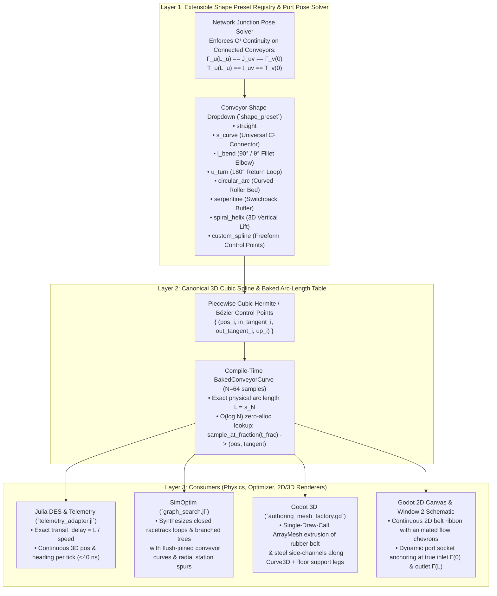
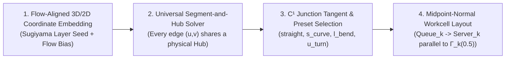

# Implementation Plan: General Parametric Conveyor Curve & Junction Alignment System

## Goal Description

Currently, conveyors in `SimViz` are modeled geometrically as isolated, axis-aligned horizontal boxes (`[px, py, pz]` + scalar `length`), while `telemetry_adapter.jl` uses a 1D X-axis flip heuristic (`reverse_dir`) to move products along the box. When the optimizer (`SimOptim`) folds a conveyor network into a 2D/3D closed loop or branched topology:
1. **Discontinuous Product Motion ("Jumping" & Direction Flipping):** Because Conveyor $u$'s outlet is the edge of its local box rather than Conveyor $v$'s inlet coordinate, products visibly jump across empty space at every conveyor-to-conveyor transition and flip between left-to-right and right-to-left motion.
2. **Disconnected Visual Aesthetics:** Conveyors appear as floating rectangular islands rather than a physically joined material-handling loop with curved roller bends, S-curves, or elbows.
3. **Lack of Shape Extensibility:** Limiting conveyors to straight boxes (or even just circular arcs) prevents authoring rich industrial conveyor geometries (S-curve merges, $90^\circ$ elbows, $180^\circ$ U-turns, serpentine accumulation beds, 3D spiral elevators, and custom splines).

This plan introduces a **3-Layer General Conveyor Curve Architecture** across Julia (`GodotBridge`, `SimOptim`) and Godot 4 (`2D Canvas`, `3D Viewport`, `Window 2 Schematic`, and `Inspector`):



---

## Architectural Pillars: Extensibility, Modularity, Maintainability, Performance

| Pillar | Design Mechanism |
| :--- | :--- |
| **Extensibility** | **Open Preset Registry (`CONVEYOR_SHAPE_PRESETS`)**: Every conveyor shape is a pure generator `(inlet_pose, outlet_pose, params) -> Vector{SplineControlPoint3D}`. Adding a new conveyor type in the future requires only registering one generator function and one schema enum entry—zero changes to DES physics, telemetry, or 2D/3D mesh extrusion. |
| **Modularity** | **Self-Contained Curve Kernel**: All curve math lives in `packages/GodotBridge/src/compiler/conveyor_curve.jl` (Julia) and `godot/scripts/conveyor_curve_3d.gd` (Godot). Neither the DES event loop (`SimDES`) nor the solver core (`SimOptim`) is polluted with rendering logic. |
| **Maintainability** | **Canonical `SceneSpec` Geometry Schema & Full Backward Compatibility**: Conveyor curves are stored in `element.geometry` (`shape_preset`, `shape_params`, `inlet_pose`, `outlet_pose`, `control_points`). Legacy scenes with only `transform.position` and `properties.length` automatically normalize to `"straight"` (or `"auto_connect"` when linked in a conveyor chain). |
| **Performance** | **Compile-Time Baking & Single-Mesh Extrusion**: Arc-length tables (`N = 64` fixed-size `NTuple` vectors) are baked **once** when a scene compiles or a conveyor is edited. Runtime entity position evaluation in `telemetry_adapter.jl` is a zero-allocation $O(\log N)$ binary search + lerp ($< 40\text{ ns}$/entity). In Godot 3D, the curved belt and side rails are extruded into a single `ArrayMesh` (2 surfaces: belt + steel frame = 1 `MeshInstance3D`), keeping 60+ FPS. |

---

## User Review Required

> [!IMPORTANT]
> **2D Canvas Conveyor Representation (Hybrid Physical Ribbon + Interactive Node):**
> In the 2D Canvas (`authoring_2d_canvas.gd`), standard elements (Source, Queue, Server, Sink) are rectangular UI cards (`SimVizAuthoringBlockNode`). When conveyors form a joined curved loop (or L-bend / S-curve), a fixed axis-aligned card with `flow_in` on the left and `flow_out` on the right causes backward wire crossings on the return leg.
>
> **Proposed Solution:**
> 1. **Physical Curved Belt Track in 2D:** Conveyors render their actual curved/joined belt track (bed fill, steel side rails, and directional flow chevrons) directly along their 2D path $\Gamma(s)$ from `inlet_pose` to `outlet_pose`.
> 2. **Compact Draggable Control Badge + True Inlet/Outlet Port Sockets:** The conveyor's interactive block handle sits centered at the curve midpoint $\Gamma(0.5L)$, while its `flow_in` and `flow_out` port sockets dynamically anchor at the true path endpoints $\Gamma(0)$ and $\Gamma(L)$ (or orient along the flow tangent), so wires and moving products align with zero visual jump.

---

## Proposed Changes

### Component 1: Canonical Conveyor Curve & Junction Alignment Engine (Julia `GodotBridge`)

#### [NEW] [conveyor_curve.jl](file:///run/media/sourabh/SANDISK-2TB/antigravity/ABM/packages/GodotBridge/src/compiler/conveyor_curve.jl)

Creates the standalone geometry kernel for 3D conveyor paths, preset generation, network junction alignment, and arc-length table baking:

1. **Core Types (Immutable, Stack-Friendly `NTuple`s):**
   ```julia
   const Vec3 = NTuple{3, Float64}

   struct Pose3D
       pos::Vec3      # (x, y, z) in world meters
       tangent::Vec3  # unit direction vector (tx, ty, tz)
       up::Vec3       # unit surface normal (0, 0, 1) default
   end

   struct SplineControlPoint3D
       pos::Vec3
       in_handle::Vec3   # relative Cubic Bézier handle incoming (-tangent * scale)
       out_handle::Vec3  # relative Cubic Bézier handle outgoing (+tangent * scale)
       up::Vec3
   end

   struct BakedConveyorCurve
       preset::Symbol
       total_length::Float64
       arc_lengths::Vector{Float64}    # size N+1, monotonically increasing 0.0 .. total_length
       positions::Vector{Vec3}         # size N+1
       tangents::Vector{Vec3}          # size N+1, unit vectors
       ups::Vector{Vec3}               # size N+1, unit normals
       control_points::Vector{SplineControlPoint3D}
   end
   ```

2. **Extensible Preset Generator Registry (`CONVEYOR_SHAPE_PRESETS`):**
   - `:straight` — Linear segment from `inlet.pos` to `outlet.pos`.
   - `:s_curve` — Single or 2-segment Cubic Hermite spline matching `(inlet.pos, inlet.tangent)` and `(outlet.pos, outlet.tangent)` with $C^1$ continuity (`handle_len = clamp(0.4 * dist, 0.5, 8.0)`).
   - `:l_bend` — Orthogonal or angled corner turn between `inlet` and `outlet` with circular-arc-approximated cubic Bézier fillet of radius $R = \text{params["bend\_radius"]}$.
   - `:u_turn` — $180^\circ$ return loop with configurable `loop_width` and `bend_radius` $R$.
   - `:circular_arc` — Constant-radius curved roller section defined by `bend_radius` $R$ and `sweep_angle_deg` $\Delta\theta \in [-360^\circ, 360^\circ]$.
   - `:serpentine` — Multi-pass switchback accumulation conveyor with `passes` $P \ge 2$ and `pass_spacing` $W$.
   - `:spiral_helix` — 3D helical vertical elevator from $z_{\text{in}}$ to $z_{\text{out}}$ with `helix_radius` $R$ and `turns` $N_{\text{turns}}$.
   - `:custom_spline` — User-defined or optimizer-defined control points with automatic Centripetal Catmull-Rom tangent auto-smoothing when explicit handles are omitted.

3. **Zero-Allocation Runtime Evaluator (`sample_conveyor_curve`):**
   ```julia
   @inline function sample_conveyor_curve(curve::BakedConveyorCurve, t_frac::Float64)::Tuple{Vec3, Vec3}
       u = clamp(t_frac, 0.0, 1.0)
       target_s = u * curve.total_length
       # Binary search in curve.arc_lengths (N=64 => 6 comparisons, zero heap allocations)
       idx = searchsortedlast(curve.arc_lengths, target_s)
       idx = clamp(idx, 1, length(curve.arc_lengths) - 1)
       s0 = curve.arc_lengths[idx]
       s1 = curve.arc_lengths[idx + 1]
       α = (s1 > s0 + 1e-9) ? (target_s - s0) / (s1 - s0) : 0.0
       p0, p1 = curve.positions[idx], curve.positions[idx + 1]
       t0, t1 = curve.tangents[idx], curve.tangents[idx + 1]
       pos = (p0[1] + α*(p1[1]-p0[1]), p0[2] + α*(p1[2]-p0[2]), p0[3] + α*(p1[3]-p0[3]))
       tan = _normalize3((t0[1] + α*(t1[1]-t0[1]), t0[2] + α*(t1[2]-t0[2]), t0[3] + α*(t1[3]-t0[3])))
       return (pos, tan)
   end
   ```

4. **Automatic Conveyor Network Junction Pose Solver (`resolve_conveyor_network_poses!`):**
   - Inspects the conveyor-to-conveyor connection graph (`u.flow_out -> v.flow_in`).
   - Ensures that if Conveyor $u$ feeds Conveyor $v$, Conveyor $u$'s `outlet_pose` equals Conveyor $v$'s `inlet_pose` ($\Gamma_u(L_u) = \Gamma_v(0)$ and $\hat{\mathbf{t}}_u(L_u) = \hat{\mathbf{t}}_v(0)$), eliminating any spatial gap or direction reversal between connected conveyors.

---

#### [MODIFY] [compiler_ir.jl](file:///run/media/sourabh/SANDISK-2TB/antigravity/ABM/packages/GodotBridge/src/compiler/compiler_ir.jl) & [scenespec_compiler.jl](file:///run/media/sourabh/SANDISK-2TB/antigravity/ABM/packages/GodotBridge/src/compiler/scenespec_compiler.jl)

- Add `conveyor_curves::Dict{String, BakedConveyorCurve}` to `ExecutionGraphIR` (with backward-compatible constructors).
- During `compile_scenespec`, after extracting elements and connections, call `bake_all_conveyor_curves!(ir, flat_spec)` so every conveyor has a `BakedConveyorCurve` and its `IRConveyorNode.length` / `transit_delay` reflects the true arc length when `auto_length` is active.

---

#### [MODIFY] [telemetry_adapter.jl](file:///run/media/sourabh/SANDISK-2TB/antigravity/ABM/packages/GodotBridge/src/runtime/telemetry_adapter.jl)

- Replace the legacy horizontal/vertical axis-aligned box interpolation (lines 222–278) with a single call to `sample_conveyor_curve`:
  ```julia
  if haskey(ir.conveyor_curves, elem_id)
      curve = ir.conveyor_curves[elem_id]
      pos, tan = sample_conveyor_curve(curve, prog_val)
      pos_x, pos_y, pos_z = pos
      spd = (conv_node isa IRConveyorNode) ? conv_node.speed : (curve.total_length / max(0.001, transit_tau))
      vel_x, vel_y = tan[1] * spd, tan[2] * spd
  ```
- Also position Station Queue & Server entities smoothly along the radial spur direction relative to the transfer hub so products diverging from a conveyor into a station queue/server don't jump sideways.

---

### Component 2: Joined Closed-Loop & Branched Conveyor Synthesis in `SimOptim`

#### [MODIFY] [graph_search.jl](file:///run/media/sourabh/SANDISK-2TB/antigravity/ABM/packages/SimOptim/src/graph_search.jl) & [examples_catalog.jl](file:///run/media/sourabh/SANDISK-2TB/antigravity/ABM/packages/GodotBridge/src/compiler/examples_catalog.jl)

- Update [`apply_topology_to_scenespec!`](file:///run/media/sourabh/SANDISK-2TB/antigravity/ABM/packages/SimOptim/src/graph_search.jl#L963-L1073) so that when `SimOptim` mutates the conveyor graph `cand.adj` and optimizes station hub coordinates `cand.coords`:
  1. Each station $k \in \{1, \dots, K\}$ acts as a **Transfer Hub** $\mathbf{H}_k = (x_k, y_k, z_k)$ with a clean unit tangent $\hat{\mathbf{t}}_k$ computed from the incoming/outgoing conveyor graph edges (e.g., tangent to the perimeter of the closed loop or along the spine).
  2. Conveyor $k$ spans **continuously from Hub $k$ to its downstream Hub $v$** (`inlet_pose = Pose3D(H_k, t_k)`, `outlet_pose = Pose3D(H_v, t_v)`):
     - In a **Closed Loop (`is_strongly_connected_loop`)**, each conveyor segment $k \to v$ uses `shape_preset = "l_bend"` (or `"circular_arc"` / `"s_curve"`) with `bend_radius = 2.5m`, forming a **completely joined, continuous closed racetrack/ring** where $\Gamma_k(1.0) \equiv \Gamma_v(0.0)$ at every station hub!
     - In a **1D Linear Spine (`collinear_1d`)**, each conveyor segment $k \to k+1$ joins end-to-end along the spine (`inlet = H_k`, `outlet = H_{k+1}`), so products flow strictly left-to-right from Station 1 $\to$ 2 $\to$ 3 $\to$ 4 without gaps.
     - Station `Queue_Chute` and `Server_Sorter` sit radially outward from each Hub $\mathbf{H}_k$ along the outward normal $\hat{\mathbf{n}}_k$, with `Source_Inbound` -> `Queue_Infeed` feeding directly into Hub 1's inlet $\mathbf{H}_1$.

---

### Component 3: Godot 3D & 2D Curved Conveyor Extrusion + Inspector Preset Dropdown

#### [NEW] [conveyor_curve_3d.gd](file:///run/media/sourabh/SANDISK-2TB/antigravity/ABM/godot/scripts/conveyor_curve_3d.gd)

Creates `SimVizConveyorCurve3D` (GDScript counterpart to `conveyor_curve.jl`):
- Implements the exact same 8 shape presets (`straight`, `s_curve`, `l_bend`, `u_turn`, `circular_arc`, `serpentine`, `spiral_helix`, `custom_spline`) and builds a native Godot `Curve3D` with `bake_interval = 0.25`.
- Provides:
  - `build_curve3d_for_element(elem, doc_store) -> Curve3D` (automatically resolving connected upstream/downstream conveyor junction poses when `auto_join` is enabled or `inlet_pose`/`outlet_pose` are present in `elem.geometry`).
  - `sample_2d_polyline(elem, doc_store, num_samples := 32) -> PackedVector2Array` for fast 2D canvas and Window 2 schematic drawing.

---

#### [MODIFY] [authoring_mesh_factory.gd](file:///run/media/sourabh/SANDISK-2TB/antigravity/ABM/godot/scripts/authoring_mesh_factory.gd) & [authoring_3d_viewport.gd](file:///run/media/sourabh/SANDISK-2TB/antigravity/ABM/godot/scripts/authoring_3d_viewport.gd)

- Upgrade `_build_conveyor(root: Node3D, elem: SceneTypes.SceneElement)` in `authoring_mesh_factory.gd`:
  - Uses `SimVizConveyorCurve3D` to sweep the cross-section along the 3D curve in local element space:
    1. **Continuous Rubber Belt Surface**: Extruded quad strip along the baked `Curve3D` frames $(\mathbf{p}_i, \hat{\mathbf{t}}_i, \hat{\mathbf{b}}_i)$.
    2. **Left & Right Steel Side-Channel Rails**: Extruded along offset curves $\mathbf{p}_i \pm \frac{W}{2}\hat{\mathbf{b}}_i$, with mitered/flush end-caps so joined conveyors look welded/bolted together with zero gap.
    3. **Support Legs with Leveling Feet**: Placed at regular arc-length intervals $\Delta s = 2.5\text{ m}$ along the curve, oriented perpendicular to the local belt tangent $\hat{\mathbf{t}}_i$ and anchored to the floor ($y = 0$).

---

#### [MODIFY] [authoring_2d_canvas.gd](file:///run/media/sourabh/SANDISK-2TB/antigravity/ABM/godot/scripts/authoring_2d_canvas.gd), [authoring_block_node.gd](file:///run/media/sourabh/SANDISK-2TB/antigravity/ABM/godot/scripts/authoring_block_node.gd), & [authoring_optim_feedback.gd](file:///run/media/sourabh/SANDISK-2TB/antigravity/ABM/godot/scripts/authoring_optim_feedback.gd)

- **2D Canvas (`authoring_2d_canvas.gd`):**
  - Adds a dedicated **Joined Conveyor Track Pass** on the canvas that draws each conveyor's curved/joined belt ribbon (dark rubber bed, green/teal side rails, and animated directional flow chevrons along the curve tangent) between its true world-space `inlet_pose` and `outlet_pose`.
  - Positions the conveyor's interactive block badge at the curve midpoint $\Gamma(0.5L)$ and aligns its `flow_in` / `flow_out` port directions with the curve's inlet/outlet tangents so connection splines never cross backward across the block.
- **Window 2 Schematic (`authoring_optim_feedback.gd`):**
  - Updates `_draw_scenespec_schematic` to render curved/joined conveyor paths using `SimVizConveyorCurve3D.sample_2d_polyline`, so the candidate preview and lightbox modal show the continuous closed-loop racetrack belt and radial sorting stations clearly.

---

#### [MODIFY] [authoring_catalog.gd](file:///run/media/sourabh/SANDISK-2TB/antigravity/ABM/godot/scripts/authoring_catalog.gd), [authoring_inspector.gd](file:///run/media/sourabh/SANDISK-2TB/antigravity/ABM/godot/scripts/authoring_inspector.gd), & [authoring_floating_inspector.gd](file:///run/media/sourabh/SANDISK-2TB/antigravity/ABM/godot/scripts/authoring_floating_inspector.gd)

- Add the **Conveyor Shape & Geometry** dropdown and dynamic parameter controls in both the Right Dock Inspector and Floating Inspector (`📐 Spatial / CAD` and `⚙ Process & DES` tabs):
  - **Shape Preset Dropdown (`shape_preset`)**:
    1. `Straight Belt` (`straight`)
    2. `Smooth S-Curve Connector` (`s_curve`)
    3. `90° / Angled Elbow (L-Bend)` (`l_bend`)
    4. `180° Return Loop (U-Turn)` (`u_turn`)
    5. `Curved Roller Section (Arc)` (`circular_arc`)
    6. `Serpentine Accumulation Switchback` (`serpentine`)
    7. `3D Spiral Elevator (Helix)` (`spiral_helix`)
    8. `Custom Control-Point Spline` (`custom_spline`)
  - **Progressive Disclosure Parameters** (shown contextually based on the selected `shape_preset`):
    - `Bend Radius (m)` (for `l_bend`, `u_turn`, `circular_arc`, `serpentine`, `spiral_helix`)
    - `Bend / Sweep Angle (°)` (for `l_bend`, `circular_arc`)
    - `Loop Width / Pitch (m)` & `Passes` (for `u_turn`, `serpentine`)
    - `Helix Turns` (for `spiral_helix`)
    - `Auto-Join Connected Conveyors` toggle (`auto_join`, default `true`)

---

## Verification Plan

### Automated Tests

1. **Julia Unit & Integration Tests (`conveyor_curve.jl` + `SimOptim` Loop Continuity):**
   ```bash
   /home/sourabh/.juliaup/bin/julia --project=packages/GodotBridge packages/GodotBridge/test/test_conveyor_curves.jl
   ```
   - Verifies all 8 shape presets (`straight`, `s_curve`, `l_bend`, `u_turn`, `circular_arc`, `serpentine`, `spiral_helix`, `custom_spline`) produce valid `BakedConveyorCurve`s with exact monotonic arc-length tables.
   - Verifies $C^0$ position and $C^1$ tangent continuity at conveyor junctions ($\|\Gamma_u(1.0) - \Gamma_v(0.0)\|_2 < 10^{-6}$) for both the initial 1D spine and the optimized 2D closed-loop solution in Problem 3 (`opt_p3_conveyor_topology`).
   - Verifies that during a live simulation step on the closed-loop conveyor network, an entity transitioning from `Conveyor_West` ($t_{\text{frac}} \to 1.0$) to `Conveyor_North` ($t_{\text{frac}} \to 0.0$) has zero spatial jump and zero allocation in `sample_conveyor_curve`.

2. **Godot Headless Curve Extrusion & Inspector Preset Test:**
   ```bash
   /home/sourabh/.local/bin/godot --headless --path /run/media/sourabh/SANDISK-2TB/antigravity/ABM/godot --script res://tests/test_conveyor_curves_3d.gd
   ```
   - Verifies `SimVizConveyorCurve3D` generates valid `Curve3D` and 2D polylines for all 8 presets.
   - Verifies `SimVizAuthoringMeshFactory.create_3d_node_for_element` builds curved `ArrayMesh` conveyor beds and support legs without errors.
   - Verifies selecting each preset in the Inspector updates `elem.geometry["shape_preset"]` and rebuilds the 2D/3D conveyor geometry.

### Manual Verification

1. Run `bash run_phase7c_demo.sh`.
2. Load **Example 3 (`3. Sorting Hub Conveyor`)**, run optimization (`[ 📊 Optimize + Feedback ]`), select the Rank #1 Closed-Loop solution, and click **`[ 🚀 Apply & Run ]`** followed by **`[ ▶ PLAY ]`**:
   - Confirm in both **2D Canvas** and **3D Viewport** that the 4 conveyors form a **continuous, joined closed-loop racetrack** with curved corners, and products glide smoothly around the loop from conveyor to conveyor with **zero jumping** and **consistent forward flow direction**.
3. Select any conveyor and change its **Conveyor Shape Preset** dropdown in the Inspector (`Straight`, `S-Curve`, `L-Bend`, `U-Turn`, `Circular Arc`, `Serpentine`, `Spiral Helix`) and confirm the 2D ribbon, 3D extruded belt mesh, and moving product paths update immediately to match the chosen curve.


---

## 7. Sub-Phase 7F-2: Universal Topology Layout & Junction Solver (All Candidate Topologies)

### 7.1 Motivation & Root-Cause Diagnosis
When inspecting non-loop / infeasible optimization candidates (such as **Branched Trees**, **Linear Spines**, **1D Unfolded Loops**, and **Split/Merge DAGs**), four layout issues caused conveyors to appear disconnected:
1. **S-Curve 2.4m Lateral Shift on Auto-Joined Conveyors**: `_gen_s_curve` (GDScript) and `generate_preset_s_curve` (Julia) applied a standalone fallback (`lateral_offset = 2.4m`) whenever `inlet_tangent`, `outlet_tangent`, and the chord were collinear (`cross_z < 0.05`), shifting `outlet_pos` 2.4m away from the downstream conveyor's inlet.
2. **Outgoing-First Point Semantics on Branches (`outdegree > 1`)**: `apply_topology_to_scenespec!` stretched Conveyor $u$ from `coords[u]` to `coords[first(outneighbors(u))]`, leaving any second branch $v_2$ (`u -> v_2`) stranded at `coords[v_2]` with a long wire jumping the gap.
3. **Isotropic Spring Embedding Without Flow-Direction Alignment**: `optimize_spatial_coordinates!` used a rotation-invariant objective initialized on a circle, causing acyclic trees to orient branches in arbitrary directions (e.g. one branch up-right and one down-left) instead of flowing coherently left-to-right from `Source_Inbound` to `Sink_Outbound`.
4. **Endpoint-Radial Station Offsets**: `Queue_k` and `Server_k` were offset radially at `5.2m` and `9.5m` from `coords[k]` (an endpoint) instead of sitting compactly alongside Conveyor $k$'s midpoint $\Gamma_k(0.5)$.

### 7.2 Universal 4-Stage Solution Architecture



#### Stage 1: Flow-Aligned Coordinate Embedding (`optimize_spatial_coordinates!` in `graph_search.jl`)
- For non-strongly-connected / acyclic / tree topologies (`!is_strongly_connected_loop(cand.adj)` and `cand.layout_mode == :folded_2d`):
  - Compute each station's topological depth $d(k)$ from Station 1 via BFS/shortest-path layers, and assign sibling branches symmetric lateral $Y$ lanes around $y = 0$ with exact edge length $d_{\min}$ (e.g. $\pm 30^\circ$ Y-split for binary branches), so `u_init_flow` starts with zero or near-zero loss and left-to-right $+X$ progression.
  - Add a gentle flow-monotonicity penalty $\alpha_{\text{flow}} \sum_{(u,v) \in E} \max(0, (x_u + 0.5\,d_{\min}) - x_v)^2$ for acyclic graphs so `NelderMead` preserves left-to-right flow while strictly satisfying $\|p_u - p_v\|_2 = d_{\min}$ and $\min_{i<j}\|p_i - p_j\|_2 \ge d_{\min}$.

#### Stage 2: Universal Segment-and-Hub Assignment (`compute_general_conveyor_poses` in `conveyor_curve.jl` & `graph_search.jl`)
Every conveyor $k \in \{1,\dots,K\}$ is mapped to an explicit `[inlet_pose, outlet_pose]` pair such that **every directed edge $(u, v) \in E$ shares a physical hub**:
- **Case A — Simple Closed Loop (`is_simple_cycle`):**
  - Uses `compute_loop_conveyor_poses` around the polygon vertices so $\mathbf{p}_{\text{next}(k)}^{\text{in}} = \mathbf{p}_k^{\text{out}}$ and $\hat{\mathbf{t}}_{\text{next}(k)}^{\text{in}} = \hat{\mathbf{t}}_k^{\text{out}}$ with `l_bend` corner fillets.
- **Case B — Acyclic / Tree / General Graph (`1 -> ...`):**
  - Each station hub $\mathbf{h}_k = \text{coords}[k]$ serves as the **discharge hub (outlet)** of Conveyor $k$: $\mathbf{p}_k^{\text{out}} = \mathbf{h}_k$.
  - If Conveyor $k$ has a parent $u \in \text{inneighbors}(k)$, Conveyor $k$'s **inlet** is placed at its parent's outlet hub:
    $$\mathbf{p}_k^{\text{in}} = \mathbf{p}_u^{\text{out}} = \mathbf{h}_u$$
    Thus, at any 1-to-$M$ branch ($u \to v_1, u \to v_2$), **both** $v_1$ and $v_2$ originate directly from $\mathbf{h}_u$ (forming a physical Y-diverter with zero gap!).
  - For root conveyor(s) (`indegree(k) == 0`, e.g. Conveyor 1):
    $$\mathbf{p}_1^{\text{in}} = \mathbf{h}_1 - d_{\min}\,\hat{\mathbf{d}}_1, \qquad \mathbf{p}_1^{\text{out}} = \mathbf{h}_1$$
    where $\hat{\mathbf{d}}_1$ aligns with the average outgoing branch direction (or $+X$).
  - If a non-simple-cycle graph has a return / back-edge $(u, v)$ where $v$ is an ancestor, a return curve connects $\mathbf{h}_u \to \mathbf{p}_v^{\text{in}}$ smoothly.

#### Stage 3: Universal $C^1$ Junction Tangents & Exact S-Curve Endpoint Preservation
- At every hub $\mathbf{h}_u$, compute the shared junction tangent $\hat{\mathbf{t}}(\mathbf{h}_u)$:
  - If Conveyor $u$ has outgoing children $v \in \text{out}(u)$, $\hat{\mathbf{t}}_u^{\text{out}}$ is the normalized incoming direction $\hat{\mathbf{d}}_u$, and each child $v$ inherits $\hat{\mathbf{t}}_v^{\text{in}} = \hat{\mathbf{t}}_u^{\text{out}}$ at $\mathbf{h}_u$ and finishes with $\hat{\mathbf{t}}_v^{\text{out}} = \hat{\mathbf{d}}_v$ (the chord direction or downstream bisector) at $\mathbf{h}_v$.
  - When a branch conveyor $v$ turns from $\hat{\mathbf{t}}_v^{\text{in}}$ at $\mathbf{h}_u$ into its lane $\mathbf{h}_v$ with $\hat{\mathbf{t}}_v^{\text{out}}$ parallel to $+X$, `s_curve` produces an exact smooth S-bend diverter connecting $\mathbf{h}_u \to \mathbf{h}_v$ with $C^1$ continuity!
- **Fix in `conveyor_curve.jl` & `conveyor_curve_3d.gd`**:
  - In `generate_preset_s_curve` and `_gen_s_curve`, only apply the standalone `lateral_offset = 2.4` fallback when `!get(params, "auto_join", false)` and `!has_explicit_poses`. Whenever `inlet_pose` and `outlet_pose` are explicitly provided, preserve `outlet_pos` exactly (`0.0m` error).

#### Stage 4: Midpoint-Normal Workcell Placement (`Queue_k -> Server_k`, `Source`, `Sink`)
- Sample each conveyor's actual curve midpoint $\mathbf{m}_k = \Gamma_k(0.5)$ and unit tangent $\hat{\mathbf{t}}_k = \hat{\mathbf{t}}_k(0.5)$, with outward normal $\hat{\mathbf{n}}_k = (-\hat{t}_{k,y}, \hat{t}_{k,x}, 0)$ (chosen to point away from the network centroid).
- Place `Queue_k` and `Server_k` **parallel to the belt** alongside $\mathbf{m}_k$:
  $$\mathbf{p}(\text{Queue}_k) = \mathbf{m}_k + 3.8\,\hat{\mathbf{n}}_k - 2.2\,\hat{\mathbf{t}}_k, \qquad \mathbf{p}(\text{Server}_k) = \mathbf{m}_k + 3.8\,\hat{\mathbf{n}}_k + 2.2\,\hat{\mathbf{t}}_k$$
- Place `Queue_Infeed` and `Source_Inbound` directly upstream of $\mathbf{p}_1^{\text{in}}$ along $-\hat{\mathbf{t}}_1^{\text{in}}$, and place `Sink_Outbound` to the right of $\max_k x_k + 8.0\text{ m}$.
