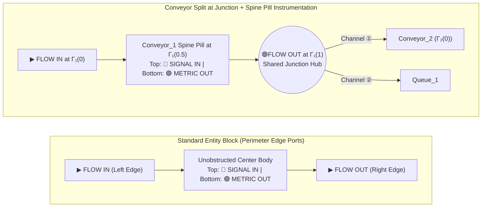

# Architectural Design Report: Port Placement, Multi-Wire Cardinality (`>1`), and Entity Telemetry Visualization

> [!IMPORTANT]
> **Purpose of This Report**
> This report consolidates our architectural analysis and visual design proposals for:
> 1. **Where ports should be located** on **Parametric Conveyors** vs. **Standard Entity Blocks** (`Source`, `Queue`, `Server`, `Sink`).
> 2. **Port Cardinality (`1` vs. `>1` / `"many"`):** Whether a single **Multi-Wire Bus Port** (`cardinality = "many"`) is feasible, more aesthetically pleasing, and capable of performing 100% of the functions currently handled by spawning multiple ports of the same type (`flow_out_1`, `flow_out_2`).
> 3. **Visualizing Entity Names, Dimensions & Live Telemetry** on the 2D canvas without clipping, wire clutter, or visual obstruction.

---

## 1. Port Placement: Standard Entity Blocks vs. Parametric Conveyors


### 1.1 Codebase Audit: Why the Current Block Layout Obstacles Occur
In [`authoring_block_node.gd`](file:///run/media/sourabh/SANDISK-2TB/antigravity/ABM/godot/scripts/authoring_block_node.gd#L194-L320) (and `_draw_ports()` at [lines 775–800](file:///run/media/sourabh/SANDISK-2TB/antigravity/ABM/godot/scripts/authoring_block_node.gd#L775-L800)), every block is currently partitioned into **4 vertical internal columns**:
1. **Left Bay (`64 px` wide):** Places **both** `Flow IN` (`col_in_x = 16 px`) **and** `Flow OUT` (`col_out_x = 46 px`) side-by-side inside the **left** side of the block.
2. **Right Bay (`64 px` wide):** Places `Signal IN` (`size.x - 48 px`) and `Metric OUT` (`size.x - 16 px`) inside the right side of the block.
3. **Center Body (`size.x - 128 px`):** Receives whatever width is left over.

This causes three visual problems:
* **Self-Crossing Flow Wires:** Because `Flow OUT` sits on the **left** side of the block (`x = 46 px`), outgoing material flow wires travelling to downstream blocks on the right must cross directly over the machine's own body.
* **Crushed Interior on Physical-Scale Blocks:** At our physical canvas scale (`1 m = 20 px`), a $3\text{ m} \times 2\text{ m}$ Server or Queue is $60\text{ px} \times 40\text{ px}$. The Left + Right bays (`128 px` total) exceed the entire block width (`mid_w < 28 px`), forcing the block into "collapsed mode" where titles shrink to `8 pt` and clip.
* **Floating Conveyor Proxy Boxes:** For curved or loop conveyors, drawing a rectangular node card (`110×54 px`) away from the belt endpoints causes connection wires to attach to an arbitrary box rather than the physical conveyor inlet and outlet.

---

### 1.2 Proposed Architecture (Shown in Diagram 1 Above)

#### A. Standard Entity Blocks (`Source`, `Queue`, `Server`, `Sink`) — **Perimeter Edge-Aligned Ports**
Instead of reserving `128 px` of internal columns for port bays, ports are mounted **directly on the outer perimeter edges** of the block:
* **Left Perimeter Edge (`x = 0`):** **`Flow In`** — Green directional chevron socket straddling the left border.
* **Right Perimeter Edge (`x = width`):** **`Flow Out`** — Green directional chevron socket straddling the right border.
* **Top Perimeter Edge (`y = 0`):** **`Signal In`** — Compact blue pin on the top border (auto-hidden in compact mode unless connected or while dragging a signal wire).
* **Bottom Perimeter Edge (`y = height`):** **`Metric Out`** — Compact purple pin on the bottom border (auto-hidden unless a Chart Station or metric wire is active).
* **Benefit:** **100% of the block's interior width** is liberated for the entity's name, icon, dimensions, and live status badge, and material flow wires enter from the left and exit from the right without ever crossing over the block body.

#### B. Parametric Conveyors (Straight, L-Bend, S-Curve, Closed Loop) — **Physical Endpoint Flow Ports + Spine Pill Signal/Metric Ports**
For conveyors, **the 2D physical belt ribbon itself is the interactive node** (eliminating the separate floating rectangular proxy card):
* **Inlet Port (`flow_in`, `cardinality = "many"`):** Anchored strictly at the **physical Tail end-cap** of the belt centerline $\Gamma(0)$, oriented along the entry tangent $\mathbf{t}(0)$.
* **Outlet Port (`flow_out`, `cardinality = "many"`):** Anchored strictly at the **physical Head end-cap** of the belt centerline $\Gamma(1)$, oriented along the exit tangent $\mathbf{t}(1)$.
* **No Mid-Belt "Side-Transfer" Ports Needed (Break Conveyor into Two at Branch Points):**
  * In `SimDES` ([`dispatch.jl`](file:///run/media/sourabh/SANDISK-2TB/antigravity/ABM/packages/SimDES/src/dispatch.jl)), a conveyor is a continuous transport zone of length $L$ and speed $v$ where routing and blocking decisions occur **strictly when an item reaches the end of the belt ($s = 1$)**.
  * If a product needs to divert to a `Queue` midway along a path, breaking the path into two joined conveyors (`Conveyor_1` $\rightarrow$ `Conveyor_2`, with `Conveyor_1`'s `flow_out` at the junction also branching to `Queue_1`) is **100% faithful to DES physics** (travel time $\Delta t = L_1 / v$, accurate upstream blocking at the split point, and zero special-case mid-belt port math).
  * This also matches how `SimOptim` ([`graph_search.jl`](file:///run/media/sourabh/SANDISK-2TB/antigravity/ABM/packages/SimOptim/src/graph_search.jl)) models closed-loop conveyors with workstation spurs.
* **Where Conveyor `Signal In` and `Metric Out` Ports Live — On the Midpoint Spine Pill ($\Gamma(0.5 L)$):**
  * Because the physical belt endpoints $\Gamma(0)$ and $\Gamma(1)$ often join directly to adjacent conveyors (`Conveyor_1` $\leftrightarrow$ `Conveyor_2`), placing `Signal`/`Metric` pins at the belt ends would collide with the material flow couplers.
  * Instead, the conveyor's **Midpoint Spine Pill Badge** at $\Gamma(0.5 L)$ acts as the conveyor's instrumentation collar—following the exact same **Top = Signal In (blue)** / **Bottom = Metric Out (purple)** rule as standard entity blocks!




---

## 2. Port Cardinality (`1` vs. `>1` / `"many"`): Feasibility & Feature Parity


### 2.1 Codebase Audit: How Cardinality & Connection Differentiation Actually Work
We audited both the Godot authoring layer and the Julia simulation compiler to verify how multi-connection ports are validated and compiled:

1. **Godot Catalog & Validator ([`authoring_catalog.gd`](file:///run/media/sourabh/SANDISK-2TB/antigravity/ABM/godot/scripts/authoring_catalog.gd#L107-L186), [`scenespec_validator.gd`](file:///run/media/sourabh/SANDISK-2TB/antigravity/ABM/godot/scripts/scenespec_validator.gd#L670-L704)):**
   * `Queue.flow_in` **already uses** `"cardinality": "many"`, and all `metric` ports use `"cardinality": "many"`.
   * However, `Conveyor.flow_in`, `Conveyor.flow_out`, `Queue.flow_out`, `Server.flow_in`, and `Server.flow_out` are currently set to `"cardinality": "one"`.
   * Because they are set to `"one"`, connecting a second wire triggers `PORT_004_CARDINALITY_EXCEEDED` unless the user clicks tiny `[+]` buttons ([`authoring_block_node.gd:540-605`](file:///run/media/sourabh/SANDISK-2TB/antigravity/ABM/godot/scripts/authoring_block_node.gd#L540-L605)) to create `flow_out_1`, `flow_out_2`, `flow_out_3`, which stretches the block vertically.

2. **Julia Compiler & Runtime ([`scenespec_compiler.jl`](file:///run/media/sourabh/SANDISK-2TB/antigravity/ABM/packages/GodotBridge/src/compiler/scenespec_compiler.jl#L179-L194) & [`des_compiler.jl`](file:///run/media/sourabh/SANDISK-2TB/antigravity/ABM/packages/GodotBridge/src/compiler/des_compiler.jl#L209-L250)):**
   * **Key Discovery:** The Julia DES compiler **does not require separate port names (`flow_out_1`, `flow_out_2`)** to distinguish connected downstream or upstream entities!
   * In [`scenespec_compiler.jl:179-194`](file:///run/media/sourabh/SANDISK-2TB/antigravity/ABM/packages/GodotBridge/src/compiler/scenespec_compiler.jl#L179-L194), outgoing connections from an element are sorted by `conn.ordering` (`1, 2, 3...`) and stored as `(dst_element_id, src_port, dst_port, conn_id)`.
   * In [`des_compiler.jl:209-250`](file:///run/media/sourabh/SANDISK-2TB/antigravity/ABM/packages/GodotBridge/src/compiler/des_compiler.jl#L209-L250), routing rules (`ProbRoute` weights in `routing_weights`, `ShortestQueueRoute`, `RoundRobinRoute`, and priority ordering) are keyed by **`target_element` (`dest_id`) and `connection.ordering`**, not by `source_port` string.
   * Furthermore, `SimOptim` ([`graph_search.jl:1170-1182`](file:///run/media/sourabh/SANDISK-2TB/antigravity/ABM/packages/SimOptim/src/graph_search.jl#L1170-L1182)) already attaches multiple outgoing conveyor connections to the single `"flow_out"` port with `"ordering" => 1, 2`!

---

### 2.2 Comparison: Multi-Port Stacking (`cardinality = 1`) vs. Multi-Wire Bus Port (`cardinality = "many"`)

| Capability / Criterion | Option A: Multi-Port Stacking (`flow_out_1`, `flow_out_2`) | Option B (Recommended): Multi-Wire Bus Port (`cardinality = "many"`) |
| :--- | :--- | :--- |
| **Visual Footprint on Block** | Stretches block vertically (`+24 px` per port); requires `[+]` / `[-]` buttons | **Zero block growth**; single sleek `FLOW OUT [N]` pill/chevron socket on right edge |
| **Connecting $1 \rightarrow N$ or $N \rightarrow 1$** | Must click `[+]` first, then drag wire to specific sub-port | **Direct drag-and-drop**: drag any number of wires directly from `FLOW OUT` or into `FLOW IN` |
| **Differentiating Connected Entities by Port/Channel Number** | Via port name suffix (`flow_out_1`, `flow_out_2`) | Via **deterministic Channel Index (`conn.ordering = #1, #2, #3`)** + `target_element` |
| **Routing Weights & Priority Display** | Hidden inside Inspector; wires look identical on canvas | Rendered directly as **inline wire badges** (`① 60% → Queue_A`, `② 40% → Queue_B`) |
| **Reordering / Unplugging Specific Channels** | Requires deleting and re-wiring between `out_1` and `out_2` | **Hover/Click Bus Popover** (`#1`, `#2`, `#3` mini pin strip) + Inspector channel list for 1-click reorder or unplug |
| **Backward Compatibility** | Legacy default | **100% backward-compatible** with existing `flow_out_1` scenespecs |

> [!TIP]
> **Recommendation on Cardinality (`>1`)**
> Upgrading `flow_in` and `flow_out` across `Conveyor`, `Queue`, and `Server` to **`cardinality = "many"` (Multi-Wire Bus Port)** is **100% feasible, requires zero breaking changes in the Julia compiler, and eliminates `[+]/[-]` port clutter**. Every wire connected to a bus port gets an explicit channel index (`#1`, `#2`, `#3` via `conn.ordering`), visible both as a numbered badge on the wire and in a hover/inspector pin strip.

---

### 2.3 Concrete Walkthrough: 5 Inputs & 4 Outputs — Deleting the 3rd Input/Output & Re-Sorting


#### Clarifying "Ports" vs. "Channels on a Single Bus Port"
Under Option B (`cardinality = "many"`), an entity connected to **5 upstream inputs** and **4 downstream outputs** does **not** spawn 5 separate left port sockets and 4 separate right port sockets. Instead:
* The block has **1 `Flow In` Bus Socket (`IN [5]`)** on its left edge and **1 `Flow Out` Bus Socket (`OUT [4]`)** on its right edge.
* Inside `IN [5]` are **5 ordered Input Channels (`①..⑤`)**, and inside `OUT [4]` are **4 ordered Output Channels (`①..④`)**, each stored as a `SceneConnection` with `conn.ordering = 1, 2, ...`.

#### Step 1: How 5 Inputs & 4 Outputs Look on the Canvas (Stage 1 in Diagram Above)
* **Subtle Micro-Spread at the Bus Socket:** So the 5 incoming wires (and 4 outgoing wires) don't visually stack into a single overlapping line right at the socket, the renderer spaces their attachment offsets by $\Delta y = 3\text{ px}$ inside the pill socket (`IN [5]` / `OUT [4]`) and fans out their Bezier control tangents.
* **Numbered Inline Wire Pills:** Each wire displays its deterministic **Channel Number (`①..⑤` / `①..④`)** at $\sim 25\%$ arc-length from the block:
  * **Left (`IN [5]`):** `① Src_1`, `② Src_2`, `③ Conv_A`, `④ Conv_B`, `⑤ Rework`
  * **Right (`OUT [4]`):** `① 40% → Q1`, `② 30% → Q2`, `③ 20% → Q3`, `④ 10% → Scrap`

#### Step 2: How the User Deletes the 3rd Input (`③ Conv_A`) and 3rd Output (`③ Q3`) (Stage 2 in Diagram Above)
Since you are deleting the **3rd connection channel** (rather than removing a structural port from the block), there are two effortless ways to do it:
1. **Direct Canvas Right-Click on Wire `③` (or its `③` Badge):** Right-clicking the wire `③ Conv_A` (or `③ 20% → Q3`) on the canvas immediately deletes that connection.
2. **Click the `IN [5]` or `OUT [4]` Bus Socket (or Open Inspector) $\rightarrow$ Click `[✕]` on Row `③`:**
   * Clicking the `IN [5]` or `OUT [4]` bus socket opens a compact **Bus Channel Popover** right beside the port listing all attached channels in order (`①` through `⑤` / `④`), each with a drag/move handle (`☰` / `↑↓`) and a red delete button `[✕]`.
   * Clicking `[✕]` on row `③ Conv_A` (in `IN [5]`) and row `③ 20% → Q3` (in `OUT [4]`) removes those exact channels without touching any other wire.

#### Step 3: Automatic Gapless Renumbering & Re-Sorting (Stage 3 in Diagram Above)
Whenever any connection is deleted (or reordered), `DocumentStore` runs `_normalize_port_channel_ordering(element_id, port_id)`:
1. **Gapless Auto-Renumbering (`1..N`):**
   * **Inputs (`IN [5]` $\rightarrow$ `IN [4]`):**
     * `① Src_1` $\rightarrow$ stays **`① Src_1`**
     * `② Src_2` $\rightarrow$ stays **`② Src_2`**
     * *(Old `③ Conv_A` deleted)*
     * `④ Conv_B` $\rightarrow$ automatically renumbers to **`③ Conv_B`** (`conn.ordering = 3`)
     * `⑤ Rework` $\rightarrow$ automatically renumbers to **`④ Rework`** (`conn.ordering = 4`)
   * **Outputs (`OUT [4]` $\rightarrow$ `OUT [3]`):**
     * `① Q1` $\rightarrow$ stays **`① Q1`**
     * `② Q2` $\rightarrow$ stays **`② Q2`**
     * *(Old `③ Q3` deleted)*
     * `④ Scrap` $\rightarrow$ automatically renumbers to **`③ Scrap`** (`conn.ordering = 3`)
2. **Interactive Re-Sorting (`↑` / `↓` or Drag in Bus Popover / Inspector):**
   * If the user wants `③ Scrap` to become Channel `②` (e.g., higher priority in Priority/Round-Robin routing), they simply drag row `③ Scrap` above `② Q2` (or click `[↑]`) in the Bus Popover or Inspector.
   * `conn.ordering` is updated to `1, 2, 3`, the canvas wire badges immediately update to `① Q1`, `② Scrap`, `③ Q2`, and the Julia compiler ([`scenespec_compiler.jl:181`](file:///run/media/sourabh/SANDISK-2TB/antigravity/ABM/packages/GodotBridge/src/compiler/scenespec_compiler.jl#L181)) sorts `downstream_conns` by the new `ordering` automatically.

---

### 2.4 Scaling to High Fan-Out ($30+$ Connections) & Maximum Allowed Connections


#### 1. What Should Be the Maximum Allowed Connections per Port (`MAX_PORT_CONNECTIONS`)?
* **Recommended Hard Limit:** **`64` connections per port** (with a soft validator advisory above `32`).
  * In large industrial layouts (e.g., a central cross-belt sorter feeding 24–36 shipping lanes, or a master `Sink` collecting from 30+ exit queues), a single port genuinely needs up to 30–64 branches.
* **Should the User Be Expected to Zoom In to Manage 30 Connections?**
  * **No.** Forcing the user to zoom in to 400% to click or read 30 individual wires is poor UX because the 30 target machines may be spread across a $100\text{ m} \times 100\text{ m}$ floorplan—zooming into the socket hides where the wires go, while zooming out causes 30 inline canvas labels to collide.

#### 2. How the Visualization Scales Gracefully from $N = 1$ to $N = 30+$ (Left Panel in Diagram Above)
To keep the canvas readable at any zoom level when $N$ grows large, we use **Two-Regime Adaptive Rendering + a Screen-Space Scrollable Pill Pop-up**:
* **Regime A ($N \le 5$ Connections):**
  * Wires exit with a subtle clamped micro-spread (capped at $\pm 12\text{ px}$ total height so wires never exceed the block's edge).
  * Inline wire badges (`① → Q1`) are shown when the block is selected/hovered.
* **Regime B ($N > 5$ Connections, e.g., $N = 30$):**
  * **Canvas Wire Dimming & Spotlight:** All 30 wires exit from the `OUT [30]` socket, but **non-focused wires render as faint translucent threads (`20%` opacity)** and **inline canvas pill badges are suppressed** so 30 labels never pile up on the floorplan.
  * **Screen-Space Scrollable & Filterable Pill Pop-up (Zero Zooming Required):**
    * Clicking (or hovering) the `OUT [30]` socket opens the **Channel Pill Pop-up** in **fixed screen space** (always crisp `11pt` text regardless of whether the 2D canvas is zoomed to `0.25x` or `2.0x`).
    * Shows a **compact scrollable list (8 rows visible at a time)** + a quick **Filter / Jump box (`Filter or #...`)**.
    * **Interactive Spotlight:** As you move your mouse over Row `(17) -> Queue_17` in the pop-up, **Wire `#17` and `Queue_17` immediately light up in `100%` glowing cyan on the canvas** with its `#17 -> Queue_17` pill badge, while the other 29 wires stay dimmed at `20%`!
    * Each row has `[↑]`, `[↓]` (or drag), and `[✕]` so deleting or re-sorting Channel `#17` out of 30 takes a single click without ever zooming in.

---

### 2.5 Contextual Port Sockets, User Gestures & 3-Mode Wire Visibility (Right Panel in Diagram Above)

#### 1. Ability to Hide/Disappear Connection Lines on the 2D Canvas
* **Yes — Essential for Clean Floorplans:** We add a **3-Mode Wire Visibility Toggle** in the top/bottom canvas toolbar (`[🔗 Wires: All | Focus | Off]`, shortcut key **`W`**):
  1. **`Wires: All`:** Shows all connection splines (with high-fan-out ports dimmed to `20%` until hovered).
  2. **`Wires: Focus` (Recommended Default for Complex Models):** Connection lines are **hidden across the canvas by default**, and **only appear for the currently hovered or selected entity** (revealing its immediate upstream inputs and downstream outputs).
  3. **`Wires: Off`:** Hides all logical connection lines so the 2D canvas is a pure, unobstructed CAD floorplan with moving products. *(Starting a wire drag temporarily reveals compatible wires/ports until the drag completes).*

#### 2. Are Port Sockets Visible All the Time? What User Gesture Reveals Them?
* **No — Port Sockets Are Hidden by Default on Unselected Blocks:**
  * When a block or conveyor is **neither hovered nor selected**, its perimeter port sockets (`IN`, `OUT`, `SIG`, `MET`) are **not drawn**—leaving a clean, uncluttered CAD machine silhouette (if wires are visible, they terminate flush against the block's border).
* **Three User Gestures That Reveal Port Sockets & the Pill Pop-up:**
  1. **Hover Over / Near the Entity (`Mouse Hover`):** Moving the cursor over an entity (or within `16 px` of its perimeter) smoothly reveals its perimeter port sockets (`IN [N]`, `OUT [M]`, `SIG`, `MET`) and subtle micro-spread.
  2. **Select the Entity (`Left-Click`):** Selecting an entity keeps its perimeter port sockets and `[N]` count badges visible; **clicking a port socket (`IN [N]` / `OUT [M]`)** opens the interactive **Channel Pill Pop-up** to inspect, highlight, re-sort, or delete individual channels.
  3. **Drag a Wire (`Press & Drag from Any Port`):** While dragging a new wire, **only compatible target sockets** across all other blocks on the canvas automatically light up with a green pulse, guiding the user to valid drop targets.

---

## 3. Visualizing Entity Names, Dimensions & Live Telemetry


### 3.1 Three-Tier Adaptive Labeling Architecture (Shown in Diagram Above)

To guarantee that entity names, dimensions, and live simulation KPIs are always readable—whether on a $15\text{ m}$ curved conveyor or a compact $2\text{ m} \times 2\text{ m}$ machine—we use three coordinated visual layers:

1. **Conveyor Spine Pill Badge & Midpoint `SIG`/`MET` Pins (On-Belt Centerline Tag):**
   * Positioned directly at the conveyor's arc-length midpoint $\Gamma(0.5 L)$ and aligned with the tangent $\mathbf{t}(0.5 L)$ (automatically flipped upright if the tangent points left so text is never upside-down).
   * Displays a high-contrast semi-transparent pill:
     $$\texttt{Conveyor\_1} \;\vert\; \texttt{15.0 m} \;\vert\; \texttt{1.5 m/s} \;\vert\; \texttt{WIP: 3}$$
   * **Top `SIG` / Bottom `MET` Pins:** Anchored on the top and bottom edges of the Spine Pill so telemetry wires to a `Chart Station` never collide with the belt's physical material-flow endpoints.
   * **Shared Junction Hubs:** Where `Conveyor_1` joins `Conveyor_2` in a closed loop, the shared junction hub cleanly branches Channel `① (70%)` into `Conveyor_2` and Channel `② (30%)` into `Queue_1` $\rightarrow$ `Server_1`.

2. **Adaptive Floating Nameplates for Compact Blocks (`Queue`, `Server`, `Source`, `Sink`):**
   * **Standard/Large Footprints ($\ge 90\text{ px}$ wide):** The unobstructed block interior displays the **Entity Name** (`Server_1`), **Subtitle / Dimensions** (`3.0m × 2.0m | Cap: 1`), and **Live Status Pill** (`BUSY · 85% Util`).
   * **Compact Footprints ($< 90\text{ px}$ wide, e.g. $2\text{m} \times 2\text{m}$):** A crisp **Floating Header Nameplate** (`Queue_1 (Buffer)` / `Server_1 (Assembly)`) floats $6\text{ px}$ above the top edge of the block so the title is never truncated, while the block interior shows pure visual telemetry:
     * **Queue Interior:** Mini capacity progress bar (`[████░░░░] 4/10`) + average wait badge.
     * **Server Interior:** Utilization status pill (`85% Util | BUSY`).

3. **Contextual Wire Channel Badges (`All | Focus | Off`):**
   * Whenever a port has $2..5$ outgoing connections and its wires are visible (`Focus` or `All` mode), each wire renders a compact pill badge showing its **Channel Index (`①`, `②`)** and **Routing Split / Rule** (e.g., `(1) 70%`, `(2) 30%`). For $>5$ connections (up to `64`), labels and individual wire highlights are inspected via the **Screen-Space Scrollable Channel Pill Pop-up**.

---

### 3.2 Context: Earlier Phase 7F Conveyor Continuity Comparison
For historical reference, here is the Phase 7F conveyor continuity comparison that motivated this port and junction architecture:

````carousel

<!-- slide -->

````

---

## 4. Summary of Files Impacted When We Implement

| Layer | File | Planned Enhancement |
| :--- | :--- | :--- |
| **Catalog & Cardinality** | [`authoring_catalog.gd`](file:///run/media/sourabh/SANDISK-2TB/antigravity/ABM/godot/scripts/authoring_catalog.gd) | Set `"cardinality": "many"` on `flow_in` and `flow_out` for `Conveyor`, `Queue`, `Server`, and `Source`; retain backward compatibility with indexed port names. |
| **Document Store & Ordering** | [`authoring_document_store.gd`](file:///run/media/sourabh/SANDISK-2TB/antigravity/ABM/godot/scripts/authoring_document_store.gd) | Add `_normalize_port_channel_ordering(elem_id, port_id)` for automatic gapless `1..N` renumbering on connection add/remove, plus `reorder_port_channel(conn_id, new_order)` for `[↑]`/`[↓]` re-sorting. |
| **2D Block Node UI** | [`authoring_block_node.gd`](file:///run/media/sourabh/SANDISK-2TB/antigravity/ABM/godot/scripts/authoring_block_node.gd) | Replace the `128 px` internal Left/Right port bays with **Contextual Perimeter Edge Sockets** (`Flow In` on left, `Flow Out` on right, `Signal` on top, `Metric` on bottom—hidden when unselected/unhovered), freeing 100% of the center body and adding **Adaptive Floating Nameplates** + interior progress bars. |
| **2D Canvas, Conveyors & Pill Pop-up** | [`authoring_2d_canvas.gd`](file:///run/media/sourabh/SANDISK-2TB/antigravity/ABM/godot/scripts/authoring_2d_canvas.gd) | Anchor conveyor `flow_in`/`flow_out` at physical belt ends $\Gamma(0), \Gamma(1)$ and `SIG`/`MET` on the **Midpoint Spine Pill** $\Gamma(0.5 L)$; add `[🔗 Wires: All \| Focus \| Off (W)]` toggle; add **Screen-Space Scrollable Channel Pill Pop-up** (supporting up to `64` connections with hover spotlight, `[↑]`/`[↓]` re-sort, and `[✕]` delete). |
| **Validator** | [`scenespec_validator.gd`](file:///run/media/sourabh/SANDISK-2TB/antigravity/ABM/godot/scripts/scenespec_validator.gd) | Enforce `MAX_PORT_CONNECTIONS = 64` (soft warning above `32`) and validate deterministic `conn.ordering`. |

