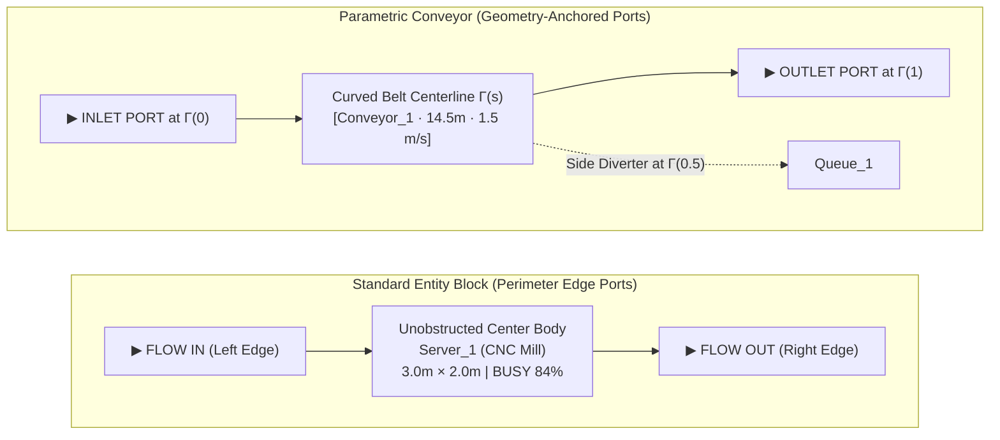

# Architectural Design Report: Port Placement, Multi-Wire Cardinality (`>1`), and Entity Telemetry Visualization

> [!IMPORTANT]
> **Purpose of This Report**
> This report consolidates our architectural analysis and visual design proposals for:
> 1. **Where ports should be located** on **Parametric Conveyors** vs. **Standard Entity Blocks** (`Source`, `Queue`, `Server`, `Sink`).
> 2. **Port Cardinality (`1` vs. `>1` / `"many"`):** Whether a single **Multi-Wire Bus Port** (`cardinality = "many"`) is feasible, more aesthetically pleasing, and capable of performing 100% of the functions currently handled by spawning multiple ports of the same type (`flow_out_1`, `flow_out_2`).
> 3. **Visualizing Entity Names, Dimensions & Live Telemetry** on the 2D canvas without clipping, wire clutter, or visual obstruction.

---

## 1. Port Placement: Standard Entity Blocks vs. Parametric Conveyors


### 1.1 Codebase Audit: Why the Current Block Layout Obstacles Occur
In [`authoring_block_node.gd`](file:///run/media/sourabh/SANDISK-2TB/antigravity/ABM/godot/scripts/authoring_block_node.gd#L194-L320) (and `_draw_ports()` at [lines 775–800](file:///run/media/sourabh/SANDISK-2TB/antigravity/ABM/godot/scripts/authoring_block_node.gd#L775-L800)), every block is currently partitioned into **4 vertical internal columns**:
1. **Left Bay (`64 px` wide):** Places **both** `Flow IN` (`col_in_x = 16 px`) **and** `Flow OUT` (`col_out_x = 46 px`) side-by-side inside the **left** side of the block.
2. **Right Bay (`64 px` wide):** Places `Signal IN` (`size.x - 48 px`) and `Metric OUT` (`size.x - 16 px`) inside the right side of the block.
3. **Center Body (`size.x - 128 px`):** Receives whatever width is left over.

This causes three visual problems:
* **Self-Crossing Flow Wires:** Because `Flow OUT` sits on the **left** side of the block (`x = 46 px`), outgoing material flow wires travelling to downstream blocks on the right must cross directly over the machine's own body.
* **Crushed Interior on Physical-Scale Blocks:** At our physical canvas scale (`1 m = 20 px`), a $3\text{ m} \times 2\text{ m}$ Server or Queue is $60\text{ px} \times 40\text{ px}$. The Left + Right bays (`128 px` total) exceed the entire block width (`mid_w < 28 px`), forcing the block into "collapsed mode" where titles shrink to `8 pt` and clip.
* **Floating Conveyor Proxy Boxes:** For curved or loop conveyors, drawing a rectangular node card (`110×54 px`) away from the belt endpoints causes connection wires to attach to an arbitrary box rather than the physical conveyor inlet and outlet.

---

### 1.2 Proposed Architecture (Shown in Diagram 1 Above)

#### A. Standard Entity Blocks (`Source`, `Queue`, `Server`, `Sink`) — **Perimeter Edge-Aligned Ports**
Instead of reserving `128 px` of internal columns for port bays, ports are mounted **directly on the outer perimeter edges** of the block:
* **Left Perimeter Edge (`x = 0`):** **`Flow In`** — Green directional chevron socket straddling the left border.
* **Right Perimeter Edge (`x = width`):** **`Flow Out`** — Green directional chevron socket straddling the right border.
* **Top Perimeter Edge (`y = 0`):** **`Signal In`** — Compact blue pin on the top border (auto-hidden in compact mode unless connected or while dragging a signal wire).
* **Bottom Perimeter Edge (`y = height`):** **`Metric Out`** — Compact purple pin on the bottom border (auto-hidden unless a Chart Station or metric wire is active).
* **Benefit:** **100% of the block's interior width** is liberated for the entity's name, icon, dimensions, and live status badge, and material flow wires enter from the left and exit from the right without ever crossing over the block body.

#### B. Parametric Conveyors (Straight, L-Bend, S-Curve, Closed Loop) — **Physical Geometry-Anchored Ports**
For conveyors, **the 2D physical belt ribbon itself is the interactive node** (eliminating the separate floating rectangular proxy card):
* **Inlet Port (`flow_in`):** Anchored directly at the **physical Tail end-cap** of the belt centerline $\Gamma(0)$, oriented along the entry tangent $\mathbf{t}(0)$.
* **Outlet Port (`flow_out`):** Anchored directly at the **physical Head end-cap** of the belt centerline $\Gamma(1)$, oriented along the exit tangent $\mathbf{t}(1)$.
* **Optional Side-Transfer / Diverter Port (`s ∈ (0, 1)`):** When a conveyor diverts items to (or receives items from) a side workstation (`Queue` or `Server`), an amber side-rail transfer socket attaches at arc-length fraction $s$ (default $s = 0.5$) along the belt edge, keeping workstation connections short, orthogonal, and physically realistic.



---

## 2. Port Cardinality (`1` vs. `>1` / `"many"`): Feasibility & Feature Parity


### 2.1 Codebase Audit: How Cardinality & Connection Differentiation Actually Work
We audited both the Godot authoring layer and the Julia simulation compiler to verify how multi-connection ports are validated and compiled:

1. **Godot Catalog & Validator ([`authoring_catalog.gd`](file:///run/media/sourabh/SANDISK-2TB/antigravity/ABM/godot/scripts/authoring_catalog.gd#L107-L186), [`scenespec_validator.gd`](file:///run/media/sourabh/SANDISK-2TB/antigravity/ABM/godot/scripts/scenespec_validator.gd#L670-L704)):**
   * `Queue.flow_in` **already uses** `"cardinality": "many"`, and all `metric` ports use `"cardinality": "many"`.
   * However, `Conveyor.flow_in`, `Conveyor.flow_out`, `Queue.flow_out`, `Server.flow_in`, and `Server.flow_out` are currently set to `"cardinality": "one"`.
   * Because they are set to `"one"`, connecting a second wire triggers `PORT_004_CARDINALITY_EXCEEDED` unless the user clicks tiny `[+]` buttons ([`authoring_block_node.gd:540-605`](file:///run/media/sourabh/SANDISK-2TB/antigravity/ABM/godot/scripts/authoring_block_node.gd#L540-L605)) to create `flow_out_1`, `flow_out_2`, `flow_out_3`, which stretches the block vertically.

2. **Julia Compiler & Runtime ([`scenespec_compiler.jl`](file:///run/media/sourabh/SANDISK-2TB/antigravity/ABM/packages/GodotBridge/src/compiler/scenespec_compiler.jl#L179-L194) & [`des_compiler.jl`](file:///run/media/sourabh/SANDISK-2TB/antigravity/ABM/packages/GodotBridge/src/compiler/des_compiler.jl#L209-L250)):**
   * **Key Discovery:** The Julia DES compiler **does not require separate port names (`flow_out_1`, `flow_out_2`)** to distinguish connected downstream or upstream entities!
   * In [`scenespec_compiler.jl:179-194`](file:///run/media/sourabh/SANDISK-2TB/antigravity/ABM/packages/GodotBridge/src/compiler/scenespec_compiler.jl#L179-L194), outgoing connections from an element are sorted by `conn.ordering` (`1, 2, 3...`) and stored as `(dst_element_id, src_port, dst_port, conn_id)`.
   * In [`des_compiler.jl:209-250`](file:///run/media/sourabh/SANDISK-2TB/antigravity/ABM/packages/GodotBridge/src/compiler/des_compiler.jl#L209-L250), routing rules (`ProbRoute` weights in `routing_weights`, `ShortestQueueRoute`, `RoundRobinRoute`, and priority ordering) are keyed by **`target_element` (`dest_id`) and `connection.ordering`**, not by `source_port` string.
   * Furthermore, `SimOptim` ([`graph_search.jl:1170-1182`](file:///run/media/sourabh/SANDISK-2TB/antigravity/ABM/packages/SimOptim/src/graph_search.jl#L1170-L1182)) already attaches multiple outgoing conveyor connections to the single `"flow_out"` port with `"ordering" => 1, 2`!

---

### 2.2 Comparison: Multi-Port Stacking (`cardinality = 1`) vs. Multi-Wire Bus Port (`cardinality = "many"`)

| Capability / Criterion | Option A: Multi-Port Stacking (`flow_out_1`, `flow_out_2`) | Option B (Recommended): Multi-Wire Bus Port (`cardinality = "many"`) |
| :--- | :--- | :--- |
| **Visual Footprint on Block** | Stretches block vertically (`+24 px` per port); requires `[+]` / `[-]` buttons | **Zero block growth**; single sleek `FLOW OUT [N]` pill/chevron socket on right edge |
| **Connecting $1 \rightarrow N$ or $N \rightarrow 1$** | Must click `[+]` first, then drag wire to specific sub-port | **Direct drag-and-drop**: drag any number of wires directly from `FLOW OUT` or into `FLOW IN` |
| **Differentiating Connected Entities by Port/Channel Number** | Via port name suffix (`flow_out_1`, `flow_out_2`) | Via **deterministic Channel Index (`conn.ordering = #1, #2, #3`)** + `target_element` |
| **Routing Weights & Priority Display** | Hidden inside Inspector; wires look identical on canvas | Rendered directly as **inline wire badges** (`① 60% → Queue_A`, `② 40% → Queue_B`) |
| **Reordering / Unplugging Specific Channels** | Requires deleting and re-wiring between `out_1` and `out_2` | **Hover/Click Bus Popover** (`#1`, `#2`, `#3` mini pin strip) + Inspector channel list for 1-click reorder or unplug |
| **Backward Compatibility** | Legacy default | **100% backward-compatible** with existing `flow_out_1` scenespecs |

> [!TIP]
> **Recommendation on Cardinality (`>1`)**
> Upgrading `flow_in` and `flow_out` across `Conveyor`, `Queue`, and `Server` to **`cardinality = "many"` (Multi-Wire Bus Port)** is **100% feasible, requires zero breaking changes in the Julia compiler, and eliminates `[+]/[-]` port clutter**. Every wire connected to a bus port gets an explicit channel index (`#1`, `#2`, `#3` via `conn.ordering`), visible both as a numbered badge on the wire and in a hover/inspector pin strip.

---

## 3. Visualizing Entity Names, Dimensions & Live Telemetry


### 3.1 Three-Tier Adaptive Labeling Architecture (Shown in Diagram 3 Above)

To guarantee that entity names, dimensions, and live simulation KPIs are always readable—whether on a $15\text{ m}$ curved conveyor or a compact $2\text{ m} \times 2\text{ m}$ machine—we propose three coordinated visual layers:

1. **Conveyor Spine Pill Badge (On-Belt Centerline Tag):**
   * Positioned directly at the conveyor's arc-length midpoint $\Gamma(0.5 L)$ and aligned with the tangent $\mathbf{t}(0.5 L)$ (automatically flipped upright if the tangent points left so text is never upside-down).
   * Displays a high-contrast semi-transparent pill:
     $$\texttt{Conveyor\_1} \;\vert\; \texttt{15.0 m} \;\vert\; \texttt{1.5 m/s} \;\vert\; \texttt{WIP: 3}$$
   * **Seamless Junction Rings:** Where `Conveyor_1` joins `Conveyor_2` in a closed loop, a subtle glowing junction collar marks the exact boundary between the two conveyors while products transition smoothly across.

2. **Adaptive Floating Nameplates for Compact Blocks (`Queue`, `Server`, `Source`, `Sink`):**
   * **Standard/Large Footprints ($\ge 90\text{ px}$ wide):** The unobstructed block interior displays the **Entity Name** (`Server_1`), **Subtitle / Dimensions** (`3.0m × 2.0m | Cap: 1`), and **Live Status Pill** (`BUSY · 84% Util`).
   * **Compact Footprints ($< 90\text{ px}$ wide, e.g. $2\text{m} \times 2\text{m}$):** A crisp **Floating Header Nameplate** (`Queue_1 (Buffer)` / `Server_1 (Assembly)`) floats $6\text{ px}$ above the top edge of the block so the title is never truncated, while the block interior shows pure visual telemetry:
     * **Queue Interior:** Mini capacity progress bar (`[████░░░░] 4/10`) + average wait badge.
     * **Server Interior:** Circular/pill utilization meter (`85% Util | BUSY`).

3. **Inline Wire Channel & Routing Badges:**
   * Whenever a port has multiple outgoing connections (`cardinality > 1`), each wire renders a compact pill badge at $25\%$ arc-length from the source port showing its **Channel Index (`①`, `②`)** and **Routing Split / Rule** (e.g., `(1) 30% -> Queue_1`), making multi-branch topology self-documenting on the canvas.

---

### 3.2 Context: Earlier Conveyor Continuity & Layout Progression
For completeness, here is how this port and labeling redesign builds directly on our General Parametric Conveyor Geometry & Universal Topology Solver from earlier in the conversation:

````carousel

<!-- slide -->

<!-- slide -->

````

---

## 4. Summary of Files Impacted When We Implement

| Layer | File | Planned Enhancement |
| :--- | :--- | :--- |
| **Catalog & Cardinality** | [`authoring_catalog.gd`](file:///run/media/sourabh/SANDISK-2TB/antigravity/ABM/godot/scripts/authoring_catalog.gd) | Set `"cardinality": "many"` on `flow_in` and `flow_out` for `Conveyor`, `Queue`, and `Server`; retain backward compatibility with indexed port names. |
| **2D Block Node UI** | [`authoring_block_node.gd`](file:///run/media/sourabh/SANDISK-2TB/antigravity/ABM/godot/scripts/authoring_block_node.gd) | Replace the `128 px` internal Left/Right port bays with **Perimeter Edge-Aligned Sockets** (`Flow In` on left border, `Flow Out` on right border, `Signal`/`Metric` on top/bottom borders), freeing 100% of the center body and adding **Adaptive Floating Nameplates** for compact blocks. |
| **2D Canvas & Conveyors** | [`authoring_2d_canvas.gd`](file:///run/media/sourabh/SANDISK-2TB/antigravity/ABM/godot/scripts/authoring_2d_canvas.gd) | Anchor conveyor `flow_in` / `flow_out` ports directly at the physical belt endpoints $\Gamma(0)$ and $\Gamma(1)$ (plus optional mid-belt side transfer port at $\Gamma(0.5)$), hide redundant rectangular conveyor proxy boxes when curve geometry is active, and render **Conveyor Spine Pill Badges** + **Inline Wire Channel Badges (`①`, `②`)**. |
| **Validator** | [`scenespec_validator.gd`](file:///run/media/sourabh/SANDISK-2TB/antigravity/ABM/godot/scripts/scenespec_validator.gd) | Allow multi-wire fan-in/fan-out on `flow_in` and `flow_out` with automatic deterministic `ordering` (`1, 2, ...`). |
