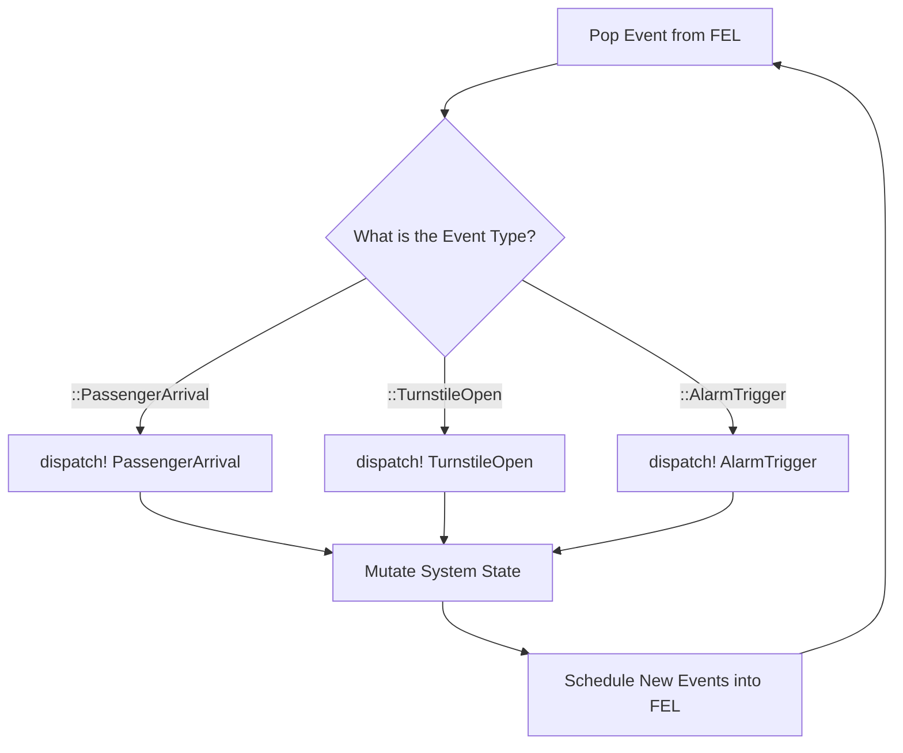
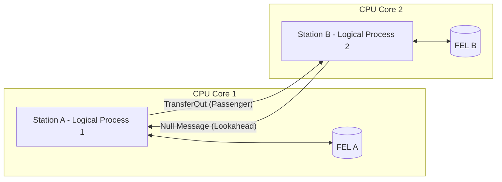
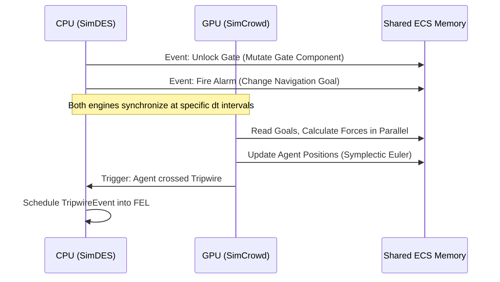

# Chapter 3: SimDES Architecture

## 3.1 The DES Paradigm and Worldviews

While continuous simulation (SimCrowd, SimFluid) models the world via differential equations evolving smoothly over $\Delta t$, many critical systems—such as electronic turnstiles, public address systems, or transit schedules—operate via instantaneous state changes. To model these, the platform utilizes **Discrete Event Simulation (DES)**. In DES, the simulation clock "jumps" directly from the timestamp of one event to the next, skipping the idle time between them [1].

Historically, simulation science defines three primary "worldviews" for implementing DES [2]:
1. **Process-Interaction (PI)**: Used by commercial software like Simio, Arena, and Python's SimPy. Entities are modeled as active "processes" that flow through flowcharts, utilizing coroutines or `yield` statements to suspend execution while they wait for resources.
2. **Activity Scanning**: The engine advances time in small increments, constantly scanning a list of conditions to see if any activity can begin. It is notoriously slow but easy to implement.
3. **Event-Scheduling**: The engine maintains a strictly ordered chronological list of future events. The engine jumps to the time of the next event and executes a specific function associated with that event type.

### 3.1.1 Antigravity's Approach: Event-Scheduling via Multiple Dispatch
Antigravity utilizes the **Event-Scheduling** worldview. Rather than forcing agents into rigid flowchart coroutines (the PI approach), the platform treats agents simply as data (ECS components) and relies on Julia's powerful **Multiple Dispatch** feature to execute logic.

When the engine pulls an event from the queue, it calls a single function: `dispatch!(world, event)`. The Julia compiler automatically routes this call to the highly optimized, specific C-level function based on the exact type of the event (e.g., `dispatch!(world, ::ArrivalEvent)` vs `dispatch!(world, ::GateOpenEvent)`). 

**Advantages**:
- **Performance**: We avoid the massive overhead of context-switching thousands of suspended coroutines (a major bottleneck in Python/SimPy).
- **Extensibility**: Users can define entirely new custom event types in their own scripts without ever modifying the core platform code.
**Disadvantages**:
- **Verbosity**: Complex multi-step operations (like a passenger going through 5 security checks) require scheduling 5 separate, chained events manually, whereas Process-Interaction languages represent this simply as sequential lines of code in a single function.

## 3.2 Data Structures: The Future Event List (FEL)
The beating heart of SimDES is the Future Event List. Because a stadium evacuation might generate millions of chronological events, scanning a flat array for the next chronological event ($O(N)$ time) is computationally disastrous. 

Antigravity implements the FEL as a **Binary Min-Heap** (via `DataStructures.PriorityQueue`). In a Min-Heap, the event with the smallest timestamp is mathematically guaranteed to always reside at the root node. 
- Extracting the next event: $O(\log N)$
- Inserting a newly scheduled event: $O(\log N)$

This data structure is standard across academic DES research [1] and allows the engine to process hundreds of thousands of events per second on a single core.

## 3.3 Concurrency: Single-Threaded vs. Conservative PDES

A common question in DES is: *Can we process the Future Event List across multiple CPU threads?* 
The answer is highly complex. If Thread A executes an event at $t=10$, and Thread B executes an event at $t=12$, Thread A might generate a new event that occurs at $t=11$. Because Thread B already advanced past $t=11$, chronological causality is violated, and the simulation is invalid [3]. 

To solve this, Antigravity implements a two-tiered architecture:

### Tier 1: Serial DES
For standard, tightly coupled spaces (like a single train station), the platform runs in Tier 1 mode. The entire FEL is processed sequentially on a single CPU thread. This guarantees perfect causality and avoids the overhead of thread locking. Given the speed of Julia's dispatch and Min-Heaps, Tier 1 easily achieves real-time simulation for standard loads.

### Tier 2: Conservative Parallel DES (PDES)
For massive simulations (e.g., modeling 15 interconnected subway stations across a city), the platform utilizes **Conservative PDES** based on the foundational **Chandy-Misra-Bryant (CMB) Null Message Protocol** [4].
- The simulation is partitioned into independent "Zones" (e.g., one Zone per subway station).
- Each Zone becomes a **Logical Process (LP)**, possessing its *own* FEL and running on its *own* dedicated CPU thread.
- When an agent boards a train to travel between stations, LP 1 sends a `TransferOut` message to LP 2 over a thread-safe Julia `Channel`. 
- To prevent deadlocks and maintain causality, LPs exchange "Null Messages" predicting the minimum time until their next interaction (Lookahead time).

## 3.4 The Hybrid CPU/GPU Architecture

A critical feature of the Antigravity platform is the simultaneous execution of continuous physics (SimCrowd/Fluid) and discrete logic (SimDES). How is computation distributed between the CPU and GPU?

**Why DES does not run on the GPU:**
GPUs derive their massive throughput from the **Single Instruction, Multiple Threads (SIMT)** architecture. Thousands of cores must execute the exact same instruction simultaneously. DES is the antithesis of SIMT; it is dominated by highly divergent branching logic (e.g., if a door is locked, do X; if an alarm sounds, do Y) and dynamic data structures (Min-Heaps). Attempting to run DES on a GPU results in "warp divergence," where the GPU effectively serializes the threads, destroying performance.

**The Hybrid Workload:**
The platform strictly segregates the workload:
- **The CPU handles SimDES**: The CPU excels at branch prediction, complex logic, and managing Min-Heaps.
- **The GPU handles SimCrowd**: The continuous physics engine (Spatial Hashing, $O(N)$ neighbor searches, and vector addition for the Symplectic Euler integrator) is perfectly suited for the GPU.

**Cross-Domain Synchronization (The ECS Bridge):**
How do the CPU logic and GPU physics actually talk to each other? They communicate via the shared **Entity-Component-System (ECS)** memory. When a DES event executes on the CPU (e.g., `TrainDoorsOpen`), it doesn't need to call complex physics functions; it simply overwrites the data in the ECS `NavigationGoal` arrays. On the very next frame, the GPU physics engine reads the updated arrays and instantly alters the physical forces. *(Note: Because the ECS architecture is the fundamental reason this platform achieves such high performance, it will be explored in profound detail in the upcoming [Chapter 4: Data-Oriented Design & ECS Architecture](04_ecs_architecture.md)).*

This hybrid approach allows the platform to achieve the "best of both worlds": massive spatial scaling for crowd physics via the GPU, while maintaining the rigorous, extensible, and perfectly causal logical scheduling of operations research DES via the CPU.

---
## References
[1] Banks, J., Carson, J. S., Nelson, B. L., & Nicol, D. M. (2009). *Discrete-Event System Simulation* (5th ed.). Pearson.
[2] Robinson, S. (2014). *Simulation: The Practice of Model Development and Use* (2nd ed.). Palgrave Macmillan. (For DES worldviews).
[3] Fujimoto, R. M. (1990). Parallel discrete event simulation. *Communications of the ACM*, 33(10), 30-53.
[4] Chandy, K. M., & Misra, J. (1979). Distributed simulation: A case study in design and verification of distributed programs. *IEEE Transactions on Software Engineering*, (5), 440-452.
