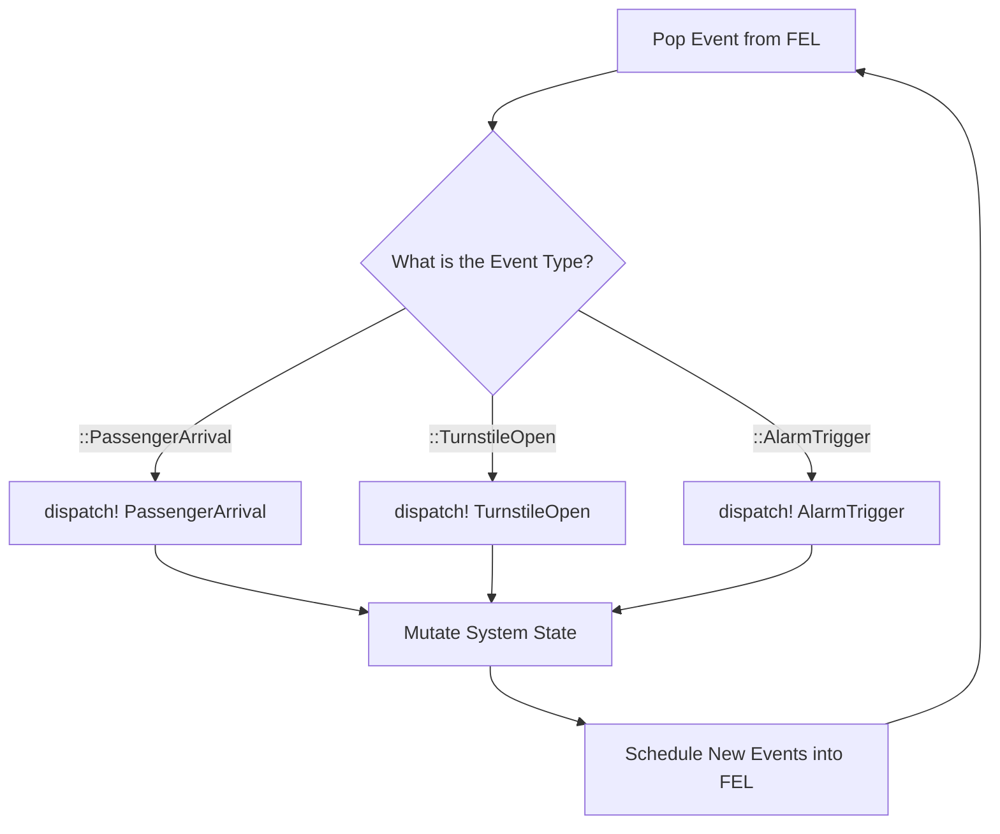
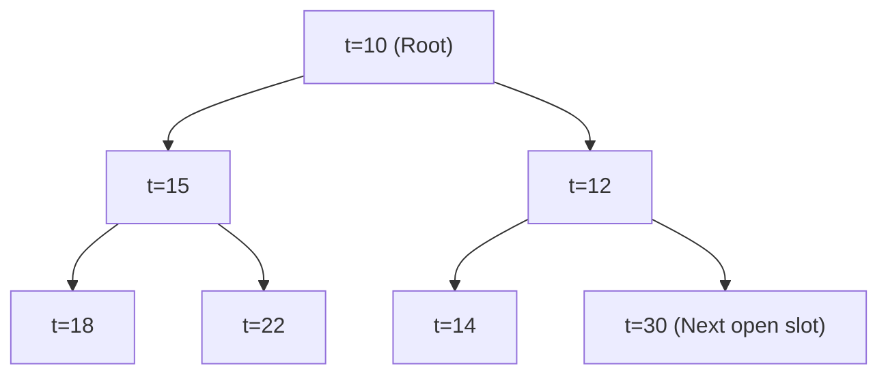
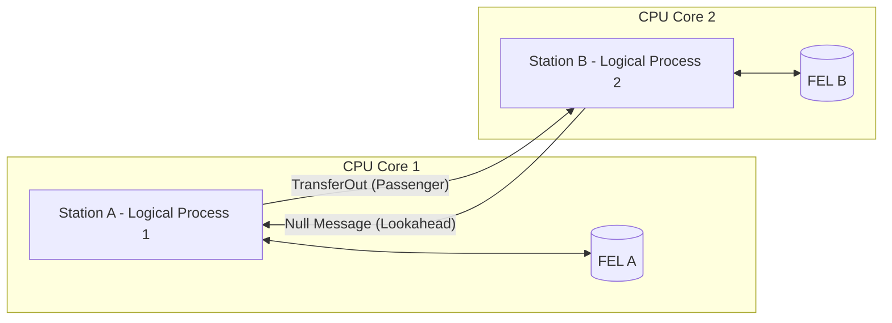
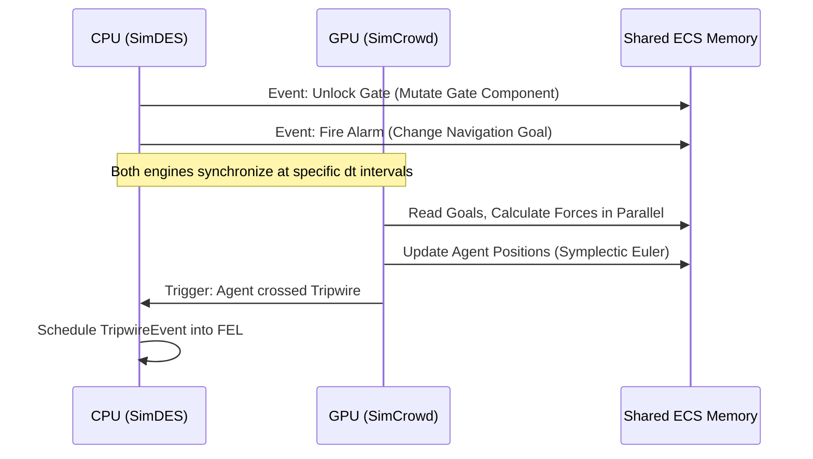

# Chapter 3: SimDES Architecture

## 3.1 The DES Paradigm and Worldviews

While continuous simulation (SimCrowd, SimFluid) models the world via differential equations evolving smoothly over $\Delta t$, many critical systems—such as electronic turnstiles, public address systems, or transit schedules—operate via instantaneous state changes. To model these, the platform utilizes **Discrete Event Simulation (DES)**. In DES, the simulation clock "jumps" directly from the timestamp of one event to the next, skipping the idle time between them [1].

Historically, simulation science defines three primary "worldviews" for implementing DES [2]:
1. **Process-Interaction (PI)**: Used by commercial software like Simio, Arena, and Python's SimPy. Entities are modeled as active "processes" that flow through flowcharts, utilizing coroutines or `yield` statements to suspend execution while they wait for resources.
2. **Activity Scanning**: The engine advances time in small increments, constantly scanning a list of conditions to see if any activity can begin. It is notoriously slow but easy to implement.
3. **Event-Scheduling**: The engine maintains a strictly ordered chronological list of future events. The engine jumps to the time of the next event and executes a specific function associated with that event type.

### 3.1.1 Antigravity's Approach: Event-Scheduling via Multiple Dispatch
Antigravity utilizes the **Event-Scheduling** worldview. Rather than forcing agents into rigid flowchart coroutines (the PI approach), the platform treats agents simply as data (ECS components) and relies on Julia's powerful **Multiple Dispatch** feature to execute logic.

When the engine pulls an event from the queue, it calls a single function: `dispatch!(world, event)`. The Julia compiler automatically routes this call to the highly optimized, specific C-level function based on the exact type of the event (e.g., `dispatch!(world, ::ArrivalEvent)` vs `dispatch!(world, ::GateOpenEvent)`). 

**Advantages**:
- **Performance**: We avoid the massive overhead of context-switching thousands of suspended coroutines (a major bottleneck in Python/SimPy).
- **Extensibility**: Users can define entirely new custom event types in their own scripts without ever modifying the core platform code.
**Disadvantages**:
- **Verbosity**: Complex multi-step operations (like a passenger going through 5 security checks) require scheduling 5 separate, chained events manually, whereas Process-Interaction languages represent this simply as sequential lines of code in a single function.

## 3.2 Data Structures: The Future Event List (FEL)

### 3.2.1 Data Structure Comparison: Arrays, Linked Lists, and Min-Heaps

If the simulation generates millions of events, the Future Event List (FEL) must insert and extract events incredibly fast. To understand why SimDES uses a **Binary Min-Heap**, we must compare it against the two basic data structures: Arrays and Linked Lists.

#### 1. The Flat Array (The Memory Shift Problem)
A flat array stores elements in contiguous memory blocks. If we keep the array sorted chronologically:
- **Finding the spot**: We can use Binary Search to find the correct insertion spot extremely quickly in $O(\log N)$ time.
- **Inserting**: To physically place the new event in the middle of the array, we must shift every subsequent element to the right by one memory slot to make room. This memory shift takes **$O(N)$** time. Inserting 1,000 events into an array of 1,000,000 events requires shifting billions of memory addresses per second, crippling the CPU.

#### 2. The Linked List (The Traversal Problem)
A Linked List solves the memory shift problem. Instead of contiguous memory, elements are scattered, and each element contains a "pointer" to the next element in line. 
- **Inserting**: Once you find the correct spot, you just change two pointers. No memory shifting is required; insertion is $O(1)$.
- **Finding the spot**: Because elements are scattered, you cannot use Binary Search (you can't jump to the middle of a linked list). You must start at the beginning and traverse pointer-by-pointer until you find the right spot. Traversing takes **$O(N)$** time.

#### 3. The Binary Min-Heap (The Tree Solution)
To bring the cost down, SimDES abandons linear structures entirely and uses a **Binary Min-Heap**. A Min-Heap is a tree where every "parent" node branches out to two "child" nodes. It enforces one strict rule: **A parent node must always have a smaller timestamp than its children.** 

> [!NOTE]
> **Min-Heap vs. Binary Search Tree (BST)**
> A very common question is: *If the root has children $t=12$ and $t=13$, how does the tree decide which side a new event like $t=15$ goes on?*
> 
> A Min-Heap is **not** a Binary Search Tree. In a BST, smaller values go left and larger values go right. A Min-Heap completely ignores left/right sorting. It enforces two strict properties:
> 1. **The Heap Property**: A parent must be smaller than its children.
> 2. **The Shape Property**: The tree must be a *complete* binary tree. This means the tree is filled strictly level-by-level, from left to right.
> 
> Therefore, a new event *always* goes into the very next available open slot on the bottom level, regardless of its timestamp. Once it is placed in that slot, it is "bubbled up" (swapped with its parent) until the Heap Property is satisfied.

By branching exponentially, the tree stays very shallow. A tree with 1,000,000 events is only $\approx 20$ layers deep ($\log_2(1,000,000) \approx 20$).

**How the Min-Heap reduces cost:**
1. **Extraction**: The next chronological event is always at the Root node ($t=10$). We pop it, move the very last node in the tree to the Root, and "sift-down" (swap it with its smallest child) until the rule is restored.
2. **Insertion**: When a new event arrives (e.g., $t=11$), we attach it to the next available left-to-right slot at the bottom of the tree. We then "sift-up" (or bubble-up), comparing it *only* to its direct parent. If it is smaller than its parent, we swap them.

Because we only swap vertically up the tree, the maximum number of comparisons and memory swaps is exactly equal to the depth of the tree: **$O(\log N)$**. 

#### Cost Comparison Summary

| Data Structure | Extract Next Event | Insert New Event | Bottleneck |
| :--- | :--- | :--- | :--- |
| **Sorted Flat Array** | $O(1)$ | $O(N)$ | Massive memory shifting |
| **Sorted Linked List**| $O(1)$ | $O(N)$ | Pointer traversal |
| **Binary Min-Heap** | $O(\log N)$ | $O(\log N)$ | **None (Optimal for DES)** |

This algorithmic breakthrough means that even if the FEL contains 1,000,000 events, inserting a new event takes a maximum of 20 extremely fast memory swaps—never an $O(N)$ mass-memory shift or pointer traversal. This allows the engine to process hundreds of thousands of asynchronous events per second on a single core [1].

## 3.3 Concurrency: Single-Threaded vs. Conservative PDES

A common question in DES is: *Can we process the Future Event List across multiple CPU threads?* 
The answer is highly complex. If Thread A executes an event at $t=10$, and Thread B executes an event at $t=12$, Thread A might generate a new event that occurs at $t=11$. Because Thread B already advanced past $t=11$, chronological causality is violated, and the simulation is invalid [3]. 

To solve this, Antigravity implements a two-tiered architecture:

### Tier 1: Serial DES
For standard, tightly coupled spaces (like a single train station), the platform runs in Tier 1 mode. The entire FEL is processed sequentially on a single CPU thread. This guarantees perfect causality and avoids the overhead of thread locking. Given the speed of Julia's dispatch and Min-Heaps, Tier 1 easily achieves real-time simulation for standard loads.

### Tier 2: Conservative Parallel DES (PDES)
For massive simulations (e.g., modeling 15 interconnected subway stations across a city), the platform utilizes **Conservative PDES** based on the foundational **Chandy-Misra-Bryant (CMB) Null Message Protocol** [4].
- The simulation is partitioned into independent "Zones" (e.g., one Zone per subway station).
- Each Zone becomes a **Logical Process (LP)**, possessing its *own* FEL and running on its *own* dedicated CPU thread.
- When an agent boards a train to travel between stations, LP 1 sends a `TransferOut` message to LP 2 over a thread-safe Julia `Channel`. 
- To prevent deadlocks and maintain causality, LPs exchange "Null Messages" predicting the minimum time until their next interaction (Lookahead time).

## 3.4 The Hybrid CPU/GPU Architecture

A critical feature of the Antigravity platform is the simultaneous execution of continuous physics (SimCrowd/Fluid) and discrete logic (SimDES). How is computation distributed between the CPU and GPU?

**Why DES does not run on the GPU:**
GPUs derive their massive throughput from the **Single Instruction, Multiple Threads (SIMT)** architecture. Thousands of cores must execute the exact same instruction simultaneously. DES is the antithesis of SIMT; it is dominated by highly divergent branching logic (e.g., if a door is locked, do X; if an alarm sounds, do Y) and dynamic data structures (Min-Heaps). Attempting to run DES on a GPU results in "warp divergence," where the GPU effectively serializes the threads, destroying performance.

**The Hybrid Workload:**
The platform strictly segregates the workload:
- **The CPU handles SimDES**: The CPU excels at branch prediction, complex logic, and managing Min-Heaps.
- **The GPU handles SimCrowd**: The continuous physics engine (Spatial Hashing, $O(N)$ neighbor searches, and vector addition for the Symplectic Euler integrator) is perfectly suited for the GPU.

**Cross-Domain Synchronization (The ECS Bridge):**
How do the CPU logic and GPU physics actually talk to each other? They communicate via the shared **Entity-Component-System (ECS)** memory. When a DES event executes on the CPU (e.g., `TrainDoorsOpen`), it doesn't need to call complex physics functions; it simply overwrites the data in the ECS `NavigationGoal` arrays. On the very next frame, the GPU physics engine reads the updated arrays and instantly alters the physical forces. *(Note: Because the ECS architecture is the fundamental reason this platform achieves such high performance, it will be explored in profound detail in the upcoming [Chapter 4: Data-Oriented Design & ECS Architecture](file:///home/sourabh/.gemini/antigravity-ide/brain/78616c9e-3fd6-407c-bebd-abc1d7c4255f/04_ecs_architecture.md)).*

This hybrid approach allows the platform to achieve the "best of both worlds": massive spatial scaling for crowd physics via the GPU, while maintaining the rigorous, extensible, and perfectly causal logical scheduling of operations research DES via the CPU.

---
## References
[1] Banks, J., Carson, J. S., Nelson, B. L., & Nicol, D. M. (2009). *Discrete-Event System Simulation* (5th ed.). Pearson.
[2] Robinson, S. (2014). *Simulation: The Practice of Model Development and Use* (2nd ed.). Palgrave Macmillan. (For DES worldviews).
[3] Fujimoto, R. M. (1990). Parallel discrete event simulation. *Communications of the ACM*, 33(10), 30-53.
[4] Chandy, K. M., & Misra, J. (1979). Distributed simulation: A case study in design and verification of distributed programs. *IEEE Transactions on Software Engineering*, (5), 440-452.
