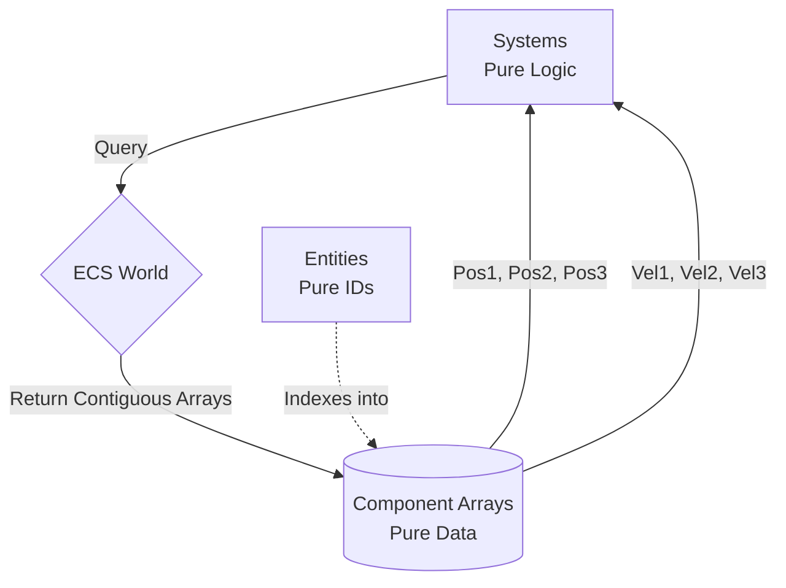

# Chapter 4: Data-Oriented Design & ECS Architecture

To simulate 100,000 interacting agents in real-time at 60 Hz, mathematical optimization of the numerical integrators (as discussed in Chapter 2) is necessary, but wholly insufficient. If the data representing those agents is fed to the CPU inefficiently, the processor will spend up to 95% of its time idling, waiting for data to arrive from main memory.

This chapter details the fundamental software architecture of the Antigravity platform. It explains the abandonment of traditional Object-Oriented paradigms in favor of **Data-Oriented Design (DoD)** and the strict implementation of an **Archetype-based Entity-Component-System (ECS)** [1].

## 4.1 The Memory Wall and the Failure of OOP

Historically, most Agent-Based Modeling (ABM) platforms (e.g., NetLogo, AnyLogic) have been built using **Object-Oriented Programming (OOP)**. In OOP, an agent is represented as an Object (or a Struct) that encapsulates both its data and its behaviors. 

A traditional OOP array of agents (an **Array of Structs** or **AoS**) looks like this in memory:
`[ Agent1(ID, Pos, Vel, Target, Mesh, Color) ] [ Agent2(...) ] [ Agent3(...) ]`

While conceptually intuitive, this design is catastrophic for performance at scale due to the hardware reality of the **Memory Wall**. Modern CPUs operate thousands of times faster than RAM. To bridge this gap, CPUs rely on small, ultra-fast cache memory (L1, L2, L3). When a CPU requests a piece of data (like `Agent1.Pos`), it does not just fetch that float; it fetches a 64-byte "cache line" of adjacent memory. 

In a physics step, the engine only cares about calculating Position and Velocity. However, in an AoS layout, `Pos` and `Vel` are interleaved with irrelevant data like `Mesh` or `Color`. The CPU's cache line fills up with useless data, forcing it to constantly fetch new cache lines from slow RAM. This is known as **cache thrashing** or a **cache miss**. Furthermore, if objects are dynamically allocated, they are scattered randomly across the heap, forcing the CPU to follow pointers ("pointer chasing"), utterly destroying memory prefetching [2].

## 4.2 Data-Oriented Design and Structure of Arrays (SoA)

**Data-Oriented Design (DoD)** flips the paradigm. Instead of asking "What is this object conceptually?", DoD asks "How does the CPU need to transform this data?" [2].

To maximize cache hits and enable automatic vectorization (SIMD), DoD mandates that homogeneous data be packed into contiguous arrays. This is known as **Structure of Arrays (SoA)**:
```
Positions:  [ Pos1, Pos2, Pos3, ... , PosN ]
Velocities: [ Vel1, Vel2, Vel3, ... , VelN ]
Meshes:     [ Msh1, Msh2, Msh3, ... , MshN ]
```
When the physics system runs, it only requests the `Positions` and `Velocities` arrays. Because the data is perfectly contiguous, a single 64-byte cache line holds multiple `Pos` vectors. The CPU's prefetcher easily predicts the linear memory access pattern, ensuring the CPU never stalls waiting for RAM. 

Crucially, **GPUs absolutely require SoA layouts**. A GPU's massive throughput relies on thousands of threads operating on contiguous arrays of identical data types. An AoS layout on a GPU results in uncoalesced memory access, destroying performance.

## 4.3 The Entity-Component-System (ECS) Architecture

To rigorously enforce Data-Oriented Design, the Antigravity platform utilizes an **Entity-Component-System (ECS)** architecture. In ECS, the traditional concept of an "Object" is completely shattered into three distinct pillars:

### 4.3.1 Entities (The Identity)
An Entity is not an object, nor a struct, nor a class. **An Entity is simply a unique integer ID** (e.g., a `UInt64`). It has no data and no methods. It serves strictly as a primary key to associate pieces of data together.

### 4.3.2 Components (The Data)
Components are pure, Plain Old Data (POD) structs. They contain strictly data, with absolutely no behavioral logic.
- `Position{Float64}(x, y)`
- `Velocity{Float64}(x, y)`
- `NavigationGoal{Float64}(target_id)`

An agent in the simulation is defined dynamically by the collection of components associated with its Entity ID.

### 4.3.3 Systems (The Logic)
Systems are pure functions containing the behavioral logic. A System has no internal state. It queries the engine for arrays of specific Components, and iterates over them. 
For example, the `PhysicsSystem` queries for all Entities that possess *both* a `Position` and `Velocity` component, retrieves those two contiguous arrays, and integrates them.



## 4.4 The Archetype Storage Model (Ark.jl)

Storing components dynamically while maintaining perfect `SoA` memory contiguity is a profound computer science challenge. To solve this, the platform utilizes an **Archetype-based ECS** (implemented via the `Ark.jl` package) [3].

An **Archetype** (sometimes called a Table) is defined as a unique combination of Component types. 
- *Archetype A*: `[Position, Velocity, NavigationGoal]` (A moving pedestrian)
- *Archetype B*: `[Position, RigidBody, Sprite]` (A static obstacle)

When an Entity is spawned, the engine inspects its components and assigns it to the corresponding Archetype table. Within that Archetype table, the components are stored in perfect, tightly packed `SoA` arrays.

If an Entity's composition changes at runtime (e.g., a pedestrian drops their luggage, losing the `Encumbered` component), the engine physically moves the Entity's data from its old Archetype table to a new Archetype table. This operation (a structural change) is expensive, but it guarantees that the arrays within the tables remain perfectly contiguous and gap-free for the Systems to iterate over.

### 4.4.1 Impact on the Antigravity Engine
By utilizing Archetype-ECS:
1. **$O(1)$ Iteration**: The `PhysicsSystem` asks for `[Position, Velocity]`. The engine instantly returns pointers to the dense arrays inside the relevant Archetypes. The CPU iterates through them with zero cache misses.
2. **GPU Offloading**: Because the tables are contiguous arrays of structs (or arrays of primitives), they can be passed directly to the GPU via CUDA/Metal without any expensive data serialization or marshalling.
3. **Cross-Domain Safety**: As discussed in Chapter 3, the discrete logic engine (SimDES) and continuous physics engine (SimCrowd) communicate flawlessly by mutating these shared ECS Component tables.

---
## References
[1] Martin, B., Hodson, D., & Merkle, L. (2026). "Understanding Unity's ECS Architecture." *Communications in Computer and Information Science (CCIS)*, vol 2723.
[2] Fabian, R. (2018). *Data-Oriented Design: Software Engineering for Limited Resources and Short Schedules*.
[3] Zhao, T., & Tasnim, A. (2026). "The Essence of Entity Component System." *Proceedings of the 41st ACM/SIGAPP Symposium on Applied Computing*.
