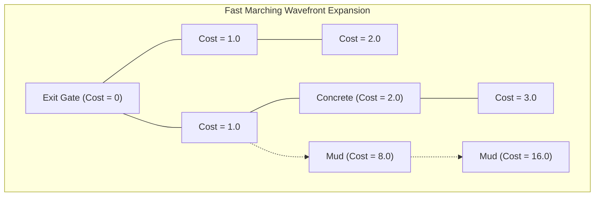

# Chapter 6: Navigation & Route Planning

Part III of this manual focuses entirely on **SimCrowd**, the continuous-time agent-based pedestrian dynamics engine. Before an agent can physically move, it must know *where* it is trying to go. 

In traditional video game architectures, navigation is handled via graph-based algorithms like A* or Dijkstra's algorithm. However, in continuous physical spaces, jumping between discrete graph nodes creates unnatural, jagged movement. 

Instead, Antigravity utilizes **Macroscopic Potential Fields**. It solves continuous Partial Differential Equations (PDEs) to create smooth, flowing navigation fields that all agents can query simultaneously.

> [!NOTE]
> **Running Example: The Stadium Exit**
> Imagine you are standing in a massive, open stadium concourse. The exit gate is 100 meters to the north. Between you and the exit is a solid concrete pillar, and a patch of sticky mud. How do you instinctively calculate the fastest route to the door? This chapter explains the math behind how the simulation answers that question.

## 6.1 The Intuition Behind the Math: Ripples in a Pond

To understand how the simulation routes people, imagine the stadium concourse is filled with water. We drop a large rock exactly at the Exit Gate. 

Ripples of water will immediately start expanding outward from the gate. 
- The time it takes for a ripple to reach your feet is the "travel time" from the gate to you.
- If we record the exact time the ripple hit every single square inch of the floor, we have created a **Time-of-Arrival Field**, which we call $\phi(x,y)$.
- At the exit gate itself, the time is zero: $\phi = 0$.

If you want to find the fastest way to the exit, you simply look at the floor, figure out which direction the time $\phi$ decreases the fastest, and walk in that direction. You are "surfing" the ripple backwards to its source. 

### 6.1.2 The Eikonal Equation

The physics of these expanding waves is governed by a famous equation in optics and wave propagation known as the **Eikonal Equation** (from the Greek *eikōn*, meaning "image"). 

$$ \|\nabla \phi(\mathbf{x})\| = \frac{1}{f(\mathbf{x})} $$

Because this equation is the backbone of the entire crowd routing system, we must rigorously break down what each term means intuitively:

*   **$\mathbf{x}$**: A specific physical coordinate on the floor $(x, y)$.
*   **$\phi(\mathbf{x})$**: The "Travel Time" or "Cost" to reach the exit from coordinate $\mathbf{x}$.
*   **$\nabla \phi(\mathbf{x})$**: The **Gradient** vector. In calculus, the gradient points in the direction where the cost $\phi$ increases the fastest (i.e., pointing directly away from the exit).
*   **$\|\nabla \phi(\mathbf{x})\|$**: The **Magnitude** of the gradient. Think of $\phi$ as a 3D topological map, where the exit is a deep valley ($\phi=0$). The magnitude is the *steepness* of the hill at your exact location.
*   **$f(\mathbf{x})$**: The local **Speed Field**. This is how fast a human can physically walk at that exact spot $\mathbf{x}$. 

**Putting it all together:**
The equation states that the steepness of the "travel time hill" ($\|\nabla \phi\|$) is exactly inversely proportional to your walking speed ($f$). 
- If you are walking on smooth concrete ($f$ is large), the travel time to the exit increases very slowly with every step away from the door. The slope is gentle.
- If you are walking through the patch of sticky mud ($f$ is very small), taking one step backward increases your travel time massively. The slope is incredibly steep.

By solving this PDE for the entire stadium $\Omega$ (where $\phi=0$ at the exit boundary $\Gamma$), the engine creates a perfect topological map of travel times that accounts for obstacles and varying terrain speeds.

## 6.2 Solving the PDE: The Fast Marching Method

Solving the Eikonal equation analytically for a complex shape like a stadium is mathematically impossible. The engine must solve it numerically.

It does this using the **Fast Marching Method (FMM)** [1]. FMM is essentially a continuous version of Dijkstra's algorithm. 
1. It overlays a discrete GPU grid over the stadium.
2. It sets the grid cells at the Exit Gate to $\phi=0$.
3. It creates an expanding "wavefront" that marches outward, calculating the arrival time $\phi$ for neighboring cells based on the local speed $f(\mathbf{x})$ in that cell.

Because the FMM algorithm is highly parallelizable, the GPU can compute the entire potential field for a stadium in a few milliseconds.

*Notice how the expanding "wave" of travel time takes much longer to propagate through the high-cost mud, naturally warping the gradient field around it.*

## 6.3 Generating the Desired Velocity ($\vec{v}_0$)

Once the potential field $\phi(\mathbf{x})$ is computed, an agent simply looks up the $\phi$ value at their current coordinate. 

Because $\phi$ represents the travel time to the exit, the optimal path is always the steepest descent of this field (walking downhill). The agent calculates its **Desired Velocity** ($\vec{v}_0$) by taking the negative normalized gradient of the field, and multiplying it by its personal desired walking speed ($v_{max}$, e.g., $1.34$ m/s):

$$ \vec{v}_0 = -v_{max} \frac{\nabla \phi(\mathbf{x})}{\|\nabla \phi(\mathbf{x})\|} $$

This creates a perfectly smooth, corner-avoiding movement vector. This vector $\vec{v}_0$ is a critical input parameter for the microscopic collision-avoidance models discussed in [Chapter 7](file:///home/sourabh/.gemini/antigravity-ide/brain/78616c9e-3fd6-407c-bebd-abc1d7c4255f/07_micro_locomotion.md).

## 6.4 Dynamic Cost Fields and Congestion Routing

In an empty stadium, the speed field $f(\mathbf{x})$ is a constant $1.34$ m/s (except at walls, where $f = 0$). 

But what happens during an evacuation when a specific hallway becomes completely jammed with people? If the mathematical speed field remains constant, agents will blindly march into the jammed hallway because it remains the "shortest geometric path," ignoring the human traffic jam.

To model intelligent human routing, SimDES employs **Dynamic Cost Fields**. 

The local speed $f(\mathbf{x})$ is not constant; it is continuously updated based on the local macroscopic crowd density $\rho(\mathbf{x})$. Using the spatial hashing grid from [Chapter 2](file:///home/sourabh/.gemini/antigravity-ide/brain/78616c9e-3fd6-407c-bebd-abc1d7c4255f/02_numerical_methods.md), the engine calculates the density at every grid cell. As density increases, the local walking speed $f(\mathbf{x})$ decreases according to empirical fundamental diagrams.

$$ f(\mathbf{x}, t) = v_{max} \cdot \left( 1 - \exp\left[-\gamma \cdot \left(\frac{1}{\rho(\mathbf{x},t)} - \frac{1}{\rho_{max}}\right)\right] \right) $$

**The Feedback Loop:**
1. A hallway becomes jammed ($\rho \rightarrow \rho_{max}$).
2. The local speed in that hallway drops to nearly zero ($f(\mathbf{x}) \rightarrow 0$).
3. The Eikonal equation ($\|\nabla \phi\| = 1/f$) assigns a massive travel-time cost to those grid cells.
4. When the GPU recalculates the FMM wave, the wave propagates incredibly slowly through the jammed hallway.
5. The resulting gradient $\nabla \phi$ naturally warps *around* the congestion, pointing incoming agents toward alternate, less-crowded exits.

This dynamic feedback loop between physical positioning (density) and the PDE routing (the Eikonal field) is the cornerstone of realistic crowd intelligence in Antigravity.

---
## References
[1] Sethian, J. A. (1996). A fast marching level set method for monotonically advancing fronts. *Proceedings of the National Academy of Sciences*, 93(4), 1591-1595.
[2] Treuille, A., Cooper, S., & Popović, Z. (2006). Continuum crowds. *ACM Transactions on Graphics (TOG)*, 25(3), 1160-1168.
