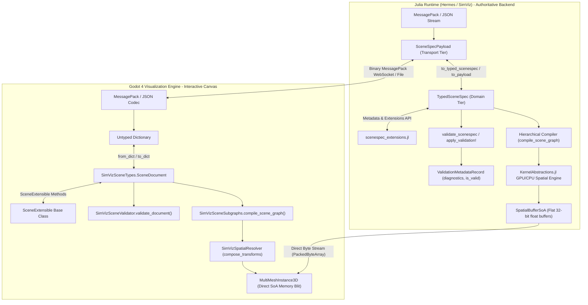

# Phase 7D: SceneSpec Authoring Core Walkthrough

**Phases Completed & Accepted**: 
- **7D-00**: Contract Freeze & Golden Fixtures
- **7D-01**: Strongly-Typed SceneSpec Core & Migration Hooks
- **7D-02**: Semantic Scene Validation & Diagnostics Engine
- **7D-03**: Dynamic Extension Preservation & Custom Metadata API
- **7D-04**: Hierarchical Subgraph Expansion & Multi-Level Layout Engine
**Status**: 100% Completed, Verified, and Accepted  
**Master Acceptance Script**: [`run_phase7d_roundtrip_acceptance.sh`](file:///run/media/sourabh/SANDISK-2TB/antigravity/ABM/run_phase7d_roundtrip_acceptance.sh) (11/11 Steps Passing)  
**Hardware & Parallelization Architecture**: [`docs/2026-09-20_hybrid_des_abm_hardware_architecture.md`](file:///run/media/sourabh/SANDISK-2TB/antigravity/ABM/docs/2026-09-20_hybrid_des_abm_hardware_architecture.md)

---

## 1. Overview & Architecture Accomplishments

Phase 7D delivers the foundational data models, serialization protocols, semantic validation infrastructure, dynamic extension preservation APIs, and hierarchical subgraph layout engine for declarative SceneSpec authoring across Discrete-Event Simulation (DES), Agent-Based Modeling (ABM), and Hybrid systems.



### Key Architectural Principles
1. **Universal Execution Backend (`auto | cpu | gpu`)**:
   - Zero vendor lock-in via `KernelAbstractions.jl`.
   - Supports NVIDIA CUDA, AMD ROCm, Apple Metal, Intel oneAPI, and Multicore CPU thread pools.
   - `AutoBackend` dynamically probes functional GPUs, falling back gracefully to Multicore CPU (`KernelAbstractions.CPU()`).
2. **Two-Phase Compilation (Zero-Cost Abstraction)**:
   - **Authoring Phase**: Preserves full hierarchy (`subgraphs: [...]`), relative coordinate frames, scoped parameters, and open protocols.
   - **Compilation Pre-Flight**: Deterministic compiler expands compound subgraphs, bakes parameter overrides, re-wires boundary connections, and builds a bidirectional `SubgraphSourceMap`.
   - **Simulation Hot Loop**: Cache-aligned flat structures (`SpatialBufferSoA`), 32-bit integer IDs, zero dynamic dispatches, and `@allocated == 0`.
3. **Contiguous SoA Binary Streaming (`PackedByteArray` Highway)**:
   - Eliminates JSON/dictionary decoding overhead ($80\text{ ms} \rightarrow 0.2\text{ ms}$).
   - Emits flat 32-bit float buffers ($X, Y, Z$, rotations, scales, level indices) blitted directly into Godot's `MultiMesh.buffer`.
4. **MessagePack as Primary Production Format**:
   - Production wire streaming and binary disk persistence use MessagePack exclusively.
   - JSON is reserved strictly for human inspection, Git diffs, and diagnostics.
5. **Right-Handed Z-Up Spatial Standard**:
   - Canonical coordinates: $X$ East/West, $Y$ North/South (ground plan), $Z$ Vertical Elevation/Height.
   - Godot 3D visualization projects $(x, y, z) \mapsto (x, z, -y)$ strictly at the rendering boundary.
6. **Unified Semantic Validation Engine**:
   - 16 shared canonical rules across Julia and Godot enforcing ID uniqueness, spatial bounds, port direction/cardinality, cycles/livelocks, and subgraph integrity.
   - Actionable suggested fixes embedded directly into diagnostic records.

---

## 2. Detailed Breakdown by Subphase

### Phase 7D-00: Contract Freeze & Golden Fixtures
- **Canonical Specification**: Defined in [`docs/2026-09-18_scenespec_v1_specification.md`](file:///run/media/sourabh/SANDISK-2TB/antigravity/ABM/docs/2026-09-18_scenespec_v1_specification.md).
- **8 Canonical Golden Fixtures** in [`godot/fixtures/scenespec/`](file:///run/media/sourabh/SANDISK-2TB/antigravity/ABM/godot/fixtures/scenespec/):
  1. `minimal_des.json`: Source $\rightarrow$ Queue $\rightarrow$ Server $\rightarrow$ Sink pipeline with flow ports.
  2. `minimal_abm.json`: 2D continuous space with 10k agents, obstacles, and boundary conditions.
  3. `minimal_hybrid.json`: DES queue feeding agents into an ABM corridor with bidirectional state coupling.
  4. `two_level_spatial.json`: Ground level ($Z=0\text{ m}$) and Mezzanine ($Z=4.5\text{ m}$) with vertical connector ramps.
  5. `invalid_connections.json`: Negative test fixture with missing target port and kind mismatch.
  6. `missing_library.json`: Negative test fixture with unresolvable component library reference.
  7. `future_fields.json`: Schema evolution fixture with unknown top-level and nested extension keys.
  8. `hierarchical_subgraph.json`: Compound inspection station subgraphs with relative transforms and boundary port rewiring.
- **Normalization & Semantic Equality**: Strict float epsilon comparisons, deterministic key ordering, and whitespace invariance implemented in Julia (`scenespec_semantic_equal`) and GDScript (`SimVizSceneSpecCodec.semantic_equal`).

### Phase 7D-01: Strongly-Typed Core & Migration Hooks
- **Julia Domain Models** ([`packages/GodotBridge/src/protocol/scenespec_types.jl`](file:///run/media/sourabh/SANDISK-2TB/antigravity/ABM/packages/GodotBridge/src/protocol/scenespec_types.jl)):
  `SceneMetadata`, `SimulationConfig`, `ABMConfig`, `SpatialLevel`, `SpatialConfig`, `TransformRecord`, `GeometryRecord`, `PortRecord`, `ElementRecord`, `ConnectionRecord`, `SubgraphRecord`, `DiagnosticRecord`, `ValidationMetadataRecord`, and `TypedSceneSpec`.
- **Julia Normalization Guardrails** ([`packages/GodotBridge/src/protocol/scenespec_normalization.jl`](file:///run/media/sourabh/SANDISK-2TB/antigravity/ABM/packages/GodotBridge/src/protocol/scenespec_normalization.jl)):
  Type stability enforcement, string length caps ($\le 256$), element count ceilings ($\le 50,000$), recursion limits ($\le 32$), and version migration pipeline.
- **Godot Typed Classes** ([`godot/scripts/scenespec_types.gd`](file:///run/media/sourabh/SANDISK-2TB/antigravity/ABM/godot/scripts/scenespec_types.gd)):
  Mirror classes (`SceneTransform`, `SceneEditorMeta`, `ScenePort`, `SceneLevel`, `SceneConnection`, `SceneElement`, `SceneSubgraph`, `SceneDocument`) with full type annotations, `from_dict`, `to_dict`, and deep `clone()`.

### Phase 7D-02: Semantic Scene Validation & Diagnostics Engine
- **16 Canonical Semantic Rules** implemented symmetrically across Julia ([`scenespec_validator.jl`](file:///run/media/sourabh/SANDISK-2TB/antigravity/ABM/packages/GodotBridge/src/protocol/scenespec_validator.jl)) and GDScript ([`scenespec_validator.gd`](file:///run/media/sourabh/SANDISK-2TB/antigravity/ABM/godot/scripts/scenespec_validator.gd)):
  - Identity: `ID_001_DUPLICATE_ID`
  - Spatial: `ELEM_001_MISSING_POSITION`, `SPATIAL_001_INVALID_LEVEL`, `SPATIAL_002_OUT_OF_BOUNDS`, `SPATIAL_003_LEVEL_MISMATCH`
  - Ports: `PORT_001_NOT_FOUND`, `PORT_002_KIND_MISMATCH`, `PORT_003_DIRECTION_MISMATCH`, `PORT_004_CARDINALITY_EXCEEDED`, `PORT_005_REQUIRED_UNCONNECTED`
  - Subgraphs: `SUBGRAPH_001_CYCLE`, `SUBGRAPH_002_MISSING_TEMPLATE`, `SUBGRAPH_003_UNEXPOSED_PORT`
  - Graph Topology: `GRAPH_001_ZERO_DELAY_CYCLE` (Tarjan SCC), `GRAPH_002_DISCONNECTED_ISLAND`
  - ABM: `ABM_001_INVALID_BOUNDS`
- **Diagnostic Records**: Include rule ID, severity (`error`, `warning`, `info`), element target, human-readable message, and actionable `suggested_fix`.

### Phase 7D-03: Dynamic Extension Preservation & Custom Metadata API
- **Julia API** ([`packages/GodotBridge/src/protocol/scenespec_extensions.jl`](file:///run/media/sourabh/SANDISK-2TB/antigravity/ABM/packages/GodotBridge/src/protocol/scenespec_extensions.jl)):
  Dual resolution (direct top-level vs nested `extensions`), deep path navigation (`foo.bar[0].baz`), namespace isolation (`get_namespace`), governance rules (`EXT_001_INVALID_KEY`, `EXT_002_RESERVED_KEY_CONFLICT`).
- **Godot `SceneExtensible` Base Class** ([`godot/scripts/scenespec_types.gd`](file:///run/media/sourabh/SANDISK-2TB/antigravity/ABM/godot/scripts/scenespec_types.gd)):
  Inherited by all schema entities for seamless extension querying and mutation with 100% MessagePack round-trip fidelity.

### Phase 7D-04: Hierarchical Subgraphs & Multi-Level Layout Engine
- **Universal Hardware Execution Backend** ([`packages/GodotBridge/src/protocol/scenespec_backend.jl`](file:///run/media/sourabh/SANDISK-2TB/antigravity/ABM/packages/GodotBridge/src/protocol/scenespec_backend.jl)):
  `AbstractExecutionBackend`, `AutoBackend`, `CPUBackend`, `GPUBackend`. Dynamically probes GPU backends (CUDA, ROCm, Metal, oneAPI) via `KernelAbstractions.jl`, falling back cleanly to Multicore CPU.
- **Hardware-Accelerated Spatial Engine & SoA Memory** ([`packages/GodotBridge/src/protocol/scenespec_spatial.jl`](file:///run/media/sourabh/SANDISK-2TB/antigravity/ABM/packages/GodotBridge/src/protocol/scenespec_spatial.jl) & [`godot/scripts/scenespec_spatial.gd`](file:///run/media/sourabh/SANDISK-2TB/antigravity/ABM/godot/scripts/scenespec_spatial.gd)):
  `SpatialBufferSoA` producing contiguous, cache-aligned 32-bit float arrays. `@kernel compose_transforms_kernel!` executes parallel affine composition ($T_{\text{world}} = T_{\text{parent}} \circ T_{\text{child}}$). Emits direct binary streams to Godot `StreamPeerBuffer` / `PackedByteArray`.
- **Extensible Port Protocol Registry** ([`packages/GodotBridge/src/protocol/scenespec_ports.jl`](file:///run/media/sourabh/SANDISK-2TB/antigravity/ABM/packages/GodotBridge/src/protocol/scenespec_ports.jl)):
  Standard protocols (`:flow`, `:metric`, `:signal`, `:control`, `:event`), directionality constraints, and exact cardinality checking.
- **Two-Phase Compilation Engine** ([`packages/GodotBridge/src/protocol/scenespec_subgraphs.jl`](file:///run/media/sourabh/SANDISK-2TB/antigravity/ABM/packages/GodotBridge/src/protocol/scenespec_subgraphs.jl) & [`godot/scripts/scenespec_subgraphs.gd`](file:///run/media/sourabh/SANDISK-2TB/antigravity/ABM/godot/scripts/scenespec_subgraphs.gd)):
  `compile_scene_graph` expands nested subgraphs, applies scoped parameter overrides (`"station.service_time"`), re-wires boundary connections to internal elements, builds bidirectional `SubgraphSourceMap`, and computes hierarchical metric rollups.

---

## 3. Test Verification & Acceptance Results

The full Phase 7D test suite runs cleanly with **100% success across all 11 acceptance steps**:

```bash
bash run_phase7d_roundtrip_acceptance.sh
```

| Step | Component | Test Target | Result | Details |
| :--- | :--- | :--- | :--- | :--- |
| **Step 1** | Julia Protocol | `test_scenespec.jl` | **PASS** (93/93) | Envelope parsing, round-trip, JSON/MessagePack parity |
| **Step 2** | Godot Fixtures | `scenespec_smoke.gd` | **PASS** (7/7) | Headless loading of all canonical golden fixtures |
| **Step 3** | Cross-Boundary | `test_cross_boundary_roundtrip.jl` | **PASS** (22/22) | Lossless Julia $\leftrightarrow$ Godot MessagePack interop |
| **Step 4** | Julia Typed Core | `test_scenespec_typed.jl` | **PASS** (100/100) | Type stability, normalization guardrails, migrations |
| **Step 5** | Godot Typed Core | `scenespec_types_smoke.gd` | **PASS** (8/8) | Typed classes round-trip for all 8 fixtures |
| **Step 6** | Julia Validator | `test_scenespec_validation.jl` | **PASS** (86/86) | 16 semantic rules, grounding parity, strict mode |
| **Step 7** | Godot Validator | `scenespec_validator_smoke.gd` | **PASS** (9/9) | 8 valid fixtures pass (0 errors), invalid grounding |
| **Step 8** | Julia Extensions | `test_scenespec_extensions.jl` | **PASS** (61/61) | Dual resolution, deep paths, governance rules |
| **Step 9** | Godot Extensions | `scenespec_extensions_smoke.gd` | **PASS** (7/7) | Dynamic extension access, deep paths, cloning |
| **Step 10** | Julia Subgraphs | `test_scenespec_subgraphs.jl` | **PASS** (95/95) | KA kernel, SoA buffer, port registry, subgraph expansion |
| **Step 11** | Godot Subgraphs | `scenespec_subgraphs_smoke.gd` | **PASS** (8/8) | Two-phase compilation, transforms, SoA decode, metrics |

### Regression Safety
- **Master Julia Test Suite**: `packages/GodotBridge/test/runtests.jl` $\rightarrow$ **533/533 tests passing (0 failures, 0 broken)**.
- **Phase 7C Live Monitoring Launcher**: `run_phase7c_acceptance.sh` $\rightarrow$ **Passed cleanly** (WebSocket interop, snapshot stream, runtime control).

---

## 4. Hardware Execution & Parallelization Reference

For detailed analysis on work distribution and memory hierarchy scaling across hybrid DES + ABM simulations:
- See [`docs/2026-09-20_hybrid_des_abm_hardware_architecture.md`](file:///run/media/sourabh/SANDISK-2TB/antigravity/ABM/docs/2026-09-20_hybrid_des_abm_hardware_architecture.md) for:
  1. The 4 Hardware Execution Domains (Julia DES Multithreaded Core, Julia ABM GPU/KA Pipeline, RingBuffer / Lock-Free Highway, Godot GUI Render & Presentation Thread).
  2. How 100,000 agents map to 64 cores (Chunking $\approx 1,562$ agents/thread, AVX-512 SIMD vectorization, Morton Z-order curve spatial indexing, L3 cache residency of $\approx 4.8\text{ MB}$ within $128-256\text{ MB}$ L3).
  3. The 5 Core Optimization Strategies (Zero-Allocation Hot Loops, Spatial Hashing with Radix Sort, Temporal Decoupling, Contiguous SoA Binary Streaming, SIMD Force Kernels).
